# VSDBabySoC_IIITGn_vsd
Final Documentation of my journey from start to end of week tasks RISC-V SoC Tapeout Program from definition and  architecture to post-layout routing.


# Week0:Tool Installation(Yosys, Iverilog , Gtkwave)

## 1.Oracle Virtual Box installed
  (https://www.virtualbox.org/wiki/Downloads )

## 2.System Installation
  6GB RAM, 50 GB HDD 
  ,Ubuntu 20.04+ 
  ,4vCPU

## 3.Tools installation 

### Yosys
```bash
$ sudo apt-get update 
$ git clone https://github.com/YosysHQ/yosys.git 
$ cd yosys 
$ sudo apt install make (If make is not installed please install it)  
$ sudo apt-get install build-essential clang bison flex \ 
libreadline-dev gawk tcl-dev libffi-dev git \ 
graphviz xdot pkg-config python3 libboost-system-dev \ 
libboost-python-dev libboost-filesystem-dev zlib1g-dev 
$ make config-gcc 
$ make  
$ sudo make install
```


### Iverilog
```bash
$ sudo apt-get update
$ sudo apt-get install iverilog
```


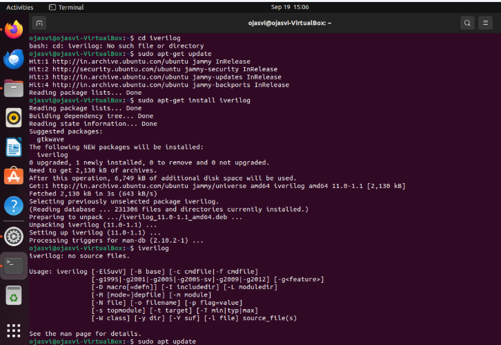


### Gtkwave
```bash
$ sudo apt-get update
$ sudo apt install gtkwave
```


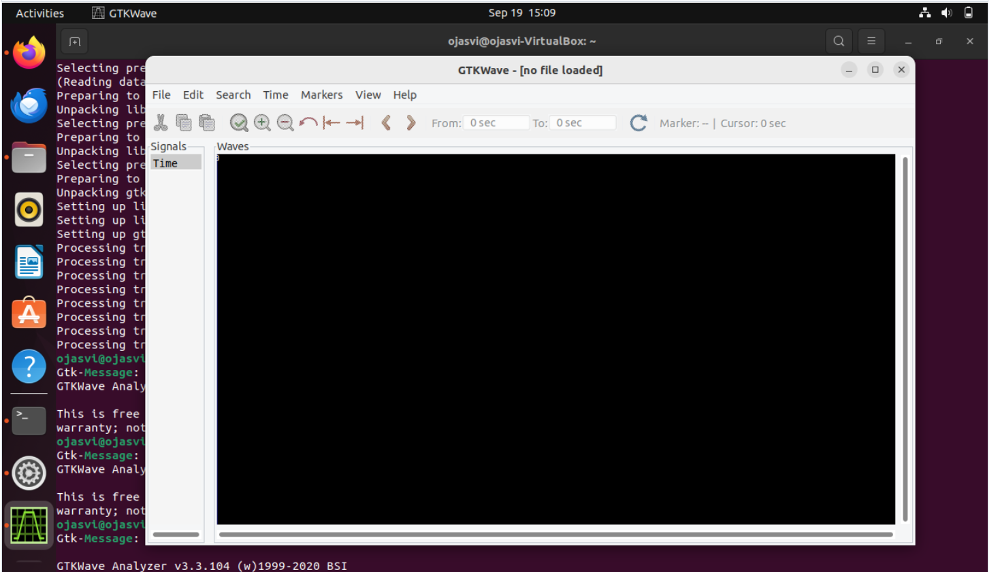

# Week1 Day1:Introduction to verilog RTL design and synthesis (using Yosys, Iverilog , Gtkwave)

Day1 consist of some RTL design , simulations(iverilog) , testbench creation and synthesis (converting RTL to netlist via yosys).

RTL design stands for Register Transfer Level Design,which is a very crucial step.It tells how data flows between registers and how logical operation are done via RTL , which makes the foundation for chip design , synthesis and verification processes.

## Setting libraries and verilog files
We will begin with cloning of 2 repositories vsdflow(https://github.com/kunalg123/vsdflow) and sky130RTLDesignAndSynthesisWorkshop(https://github.com/kunalg123/sky130RTLDesignAndSynthesisWorkshop) which have the required files and libraries that we would need to do simulation and logic synthesis .
```bash
$ git clone https://github.com/kunalg123/vsdflow.git 
$ git clone https://github.com/kunalg123/sky130RTLDesignAndSynthesisWorkshop
```
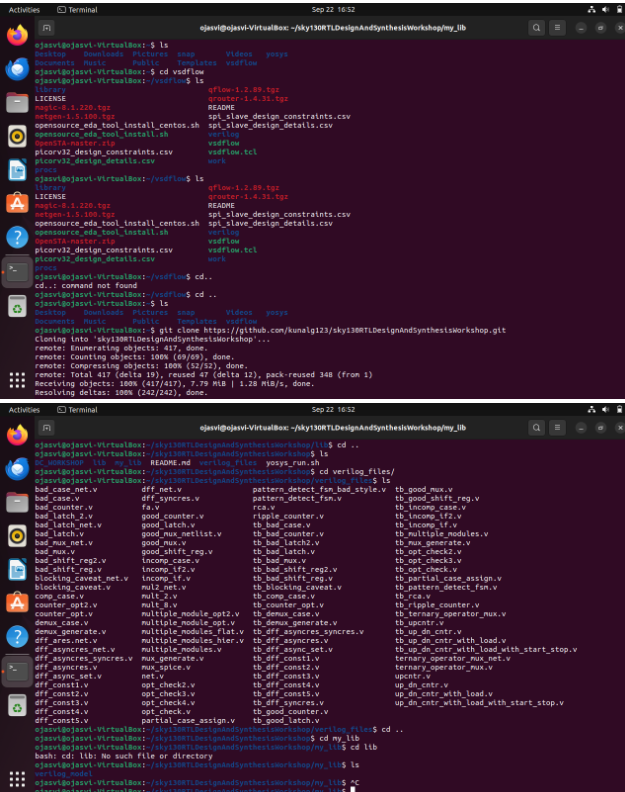

## Iverilog simulation of mux
Now when you already did cloning after that first lets open RTL design in gtkwave via creation of testbench.
```bash
$ iverilog good_mux.v tb_good_mux.v
$ ./a.out
$ gtkwave tb_good_mux.vcd
```
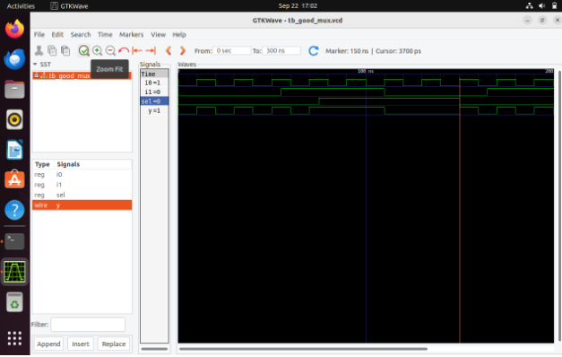

Now to open .v files , make sure to install gvim 
```bash
$ gvim tb_good_mux.v -o good_mux.v
```
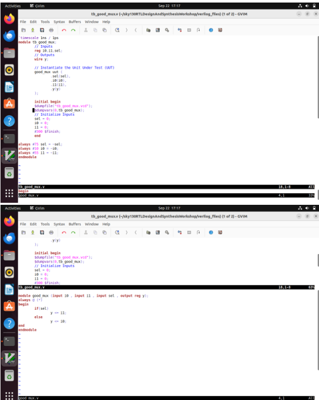

## Yosys simulation
After you are done with RTL design with testbench using yosys as synthesizer.
```bash
$yosys                                                                             
yosys> read_liberty -lib ../my_lib/lib/sky130_fd_sc_hd__tt_025C_1v80.lib           
yosys> read_verilog good_mux.v                                                     
yosys> synth -top good_mux                                                          
yosys> abc -liberty ../my_lib/lib/sky130_fd_sc_hd__tt_025C_1v80.lib                     
yosys> show
```
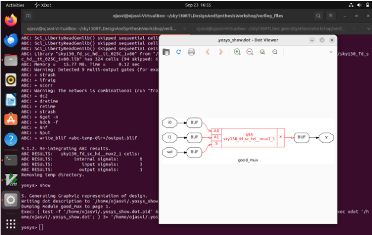

```bash
yosys> write_verilog good_mux_netlist.v
yosys> !gvim good_mux_netlist.v
yosys> write_verilog -noattr good_mux_netlist.v
yosys> !gvim good_mux_netlist.v
```
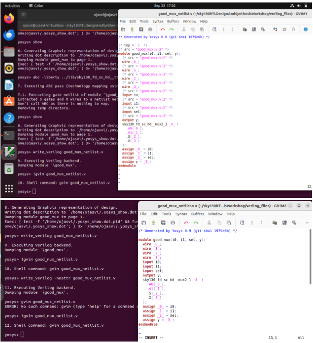


# Week1 Day2:Hierarchical vs Flat Synthesis and Various flop coding styles 

Day2 consist of some working on multiple_modules.v and its subsequent sub-modules.

Now first lets go on meaning of one of the library sky130_fd_sc_hd_tt_025C_1v80.lib.Whereas fd denotes foundry ,sd denotes standard cell ,hd denotes high density, tt denotes typical process ,025C denotes temperature and 1v80 denotes voltage.(tt_025C_1v80 called as process, temperature and voltage)

## Hierarchical vs Flat Synthesis
We will begin with multiple_module.v
```bash
$ gvim multiple_modules.v
```


```bash
$yosys                                                                             
yosys> read_liberty -lib ../my_lib/lib/sky130_fd_sc_hd__tt_025C_1v80.lib           
yosys> read_verilog good_mux.v                                                     
yosys> synth -top good_mux
```
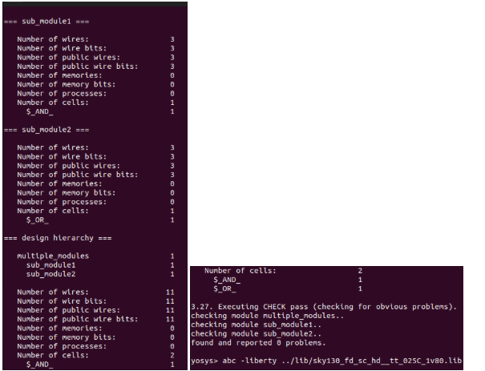

```bash                                                         
yosys> abc -liberty ../my_lib/lib/sky130_fd_sc_hd__tt_025C_1v80.lib                     
yosys> show multiple_modules
```
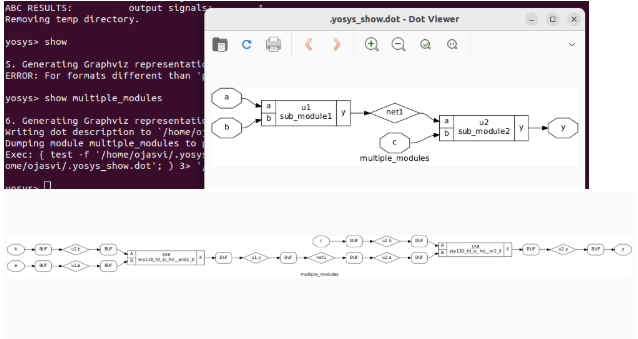

```bash                                                         
yosys> write_verilog -noattr multiple_modules_hier.v                   
yosys> !gvim multiple_modules_hier.v
```
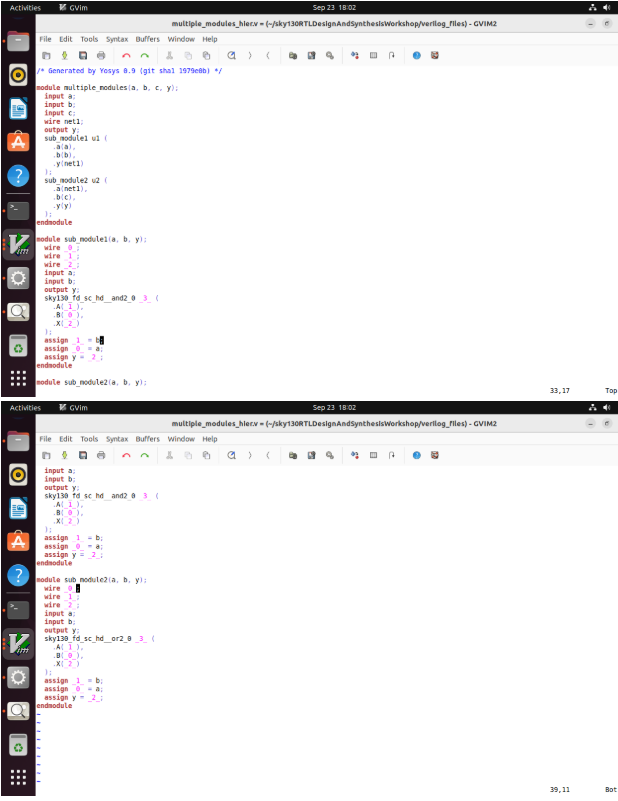

### Remember you need to flatten these multiple modules because of that yosys> !gvim -noattr multiple_modules_hier.v is causing error once you do flatten no error comes.
```bash
yosys>flatten                                                    
yosys> write_verilog -noattr multiple_modules_hier.v                   
yosys> !gvim multiple_modules_hier.v
```
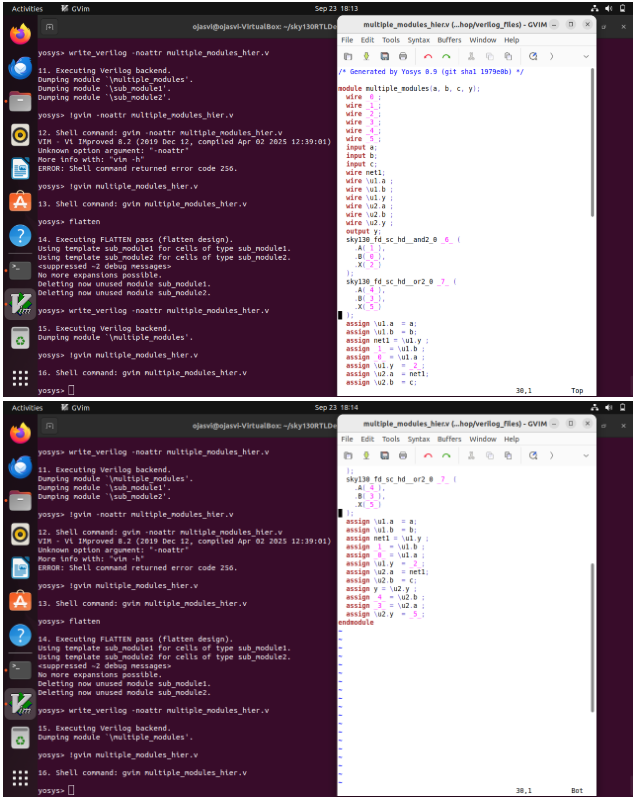
### Now lets get sub-modules separately
```bash
$yosys                                                                             
yosys> read_liberty -lib ../my_lib/lib/sky130_fd_sc_hd__tt_025C_1v80.lib           
yosys> read_verilog good_mux.v                                                     
yosys> synth -top sub_module1
yosys> abc -liberty ../my_lib/lib/sky130_fd_sc_hd__tt_025C_1v80.lib
yosys> show
```
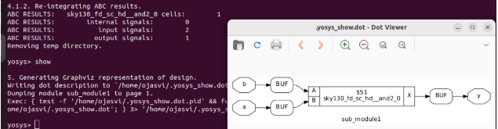


## Various flop coding styles 

Flipflops stores single bit data and they are used to avoid glitches in sequential circuit design whereas in combinational circuit design there are no such memory storing devices causing glitches.(Example D-flipflops,SR-flipflops)
Let's start,
```bash
$ iverilog dff_asyncres.v tb_dff_asyncres.v
$ ./a.out
$ gtkwave tb_dff_asyncres.vcd
```
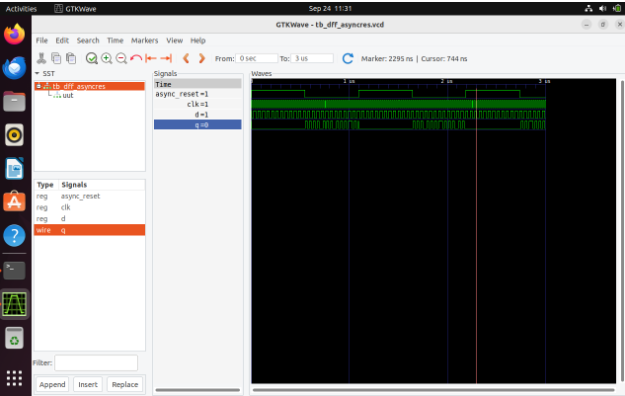

```bash
$yosys
yosys> read_liberty -lib ../my_lib/lib/sky130_fd_sc_hd__tt_025C_1v80.lib           
yosys> read_verilog dff_asyncres.v                                                     
yosys> synth -top dff_asyncres                                                         
yosys> dfflibmap -liberty ../my_lib/lib/sky130_fd_sc_hd__tt_025C_1v80.lib
yosys> abc -liberty ../my_lib/lib/sky130_fd_sc_hd__tt_025C_1v80.lib                    
yosys> show 
```
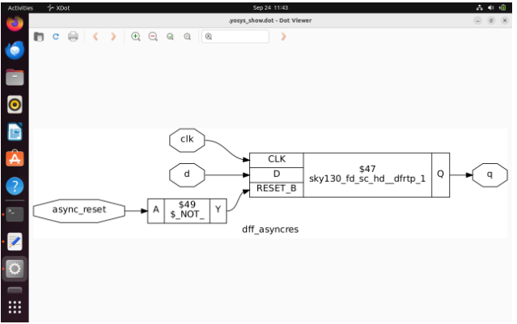

### Similarly more examples
```bash
$ iverilog dff_async_set.v tb_dff_async_set.v
$ ./a.out
$ gtkwave tb_dff_async_set.vcd
$yosys
yosys> read_liberty -lib ../my_lib/lib/sky130_fd_sc_hd__tt_025C_1v80.lib           
yosys> read_verilog dff_async_set.v                                                     
yosys> synth -top dff_asyncres_set                                                         
yosys> dfflibmap -liberty ../my_lib/lib/sky130_fd_sc_hd__tt_025C_1v80.lib
yosys> abc -liberty ../my_lib/lib/sky130_fd_sc_hd__tt_025C_1v80.lib                    
yosys> show 
```
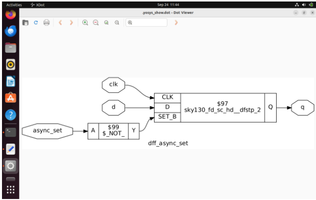

```bash
$ iverilog dff_asyncres_syncres.v tb_dff_asyncres_syncres.v
$ ./a.out
$ gtkwave tb_dff_asyncres_syncres.vcd
$yosys
yosys> read_liberty -lib ../my_lib/lib/sky130_fd_sc_hd__tt_025C_1v80.lib           
yosys> read_verilog dff_asyncres_syncres.v
yosys> synth -top dff_asyncres_syncres                                                        
yosys> dfflibmap -liberty ../my_lib/lib/sky130_fd_sc_hd__tt_025C_1v80.lib
yosys> abc -liberty ../my_lib/lib/sky130_fd_sc_hd__tt_025C_1v80.lib                    
yosys> show 
```
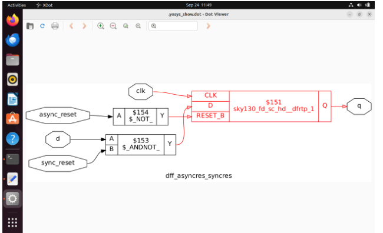

### Some examples related to mult files

```bash
$ gvim mult8.v
```
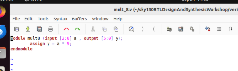

```bash
$ gvim mult2.v
```
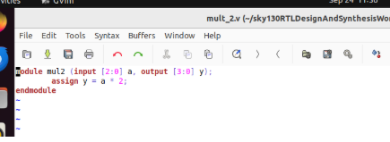

```bash
$yosys
yosys> read_liberty -lib ../my_lib/lib/sky130_fd_sc_hd__tt_025C_1v80.lib           
yosys> read_verilog mult_2.v
yosys> synth -top mul2                                                        
yosys> abc -liberty ../my_lib/lib/sky130_fd_sc_hd__tt_025C_1v80.lib                    
yosys> show
yosys> write_verilog -noattr mult_2.v                   
yosys> !gvim mul2_net.v
```
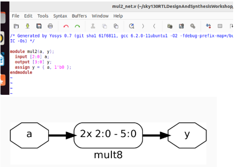

# Week1 Day3:Optimization combinational logic , sequential and unused state

Day3 consist of some RTL design , simulations(iverilog) , testbench creation and synthesis (converting RTL to netlist via yosys).

## Optimization combinational logic
Squeezing the logic to get the most optimised design (area and power saving) , constant propagation (direct optimization) , Boolean logic optimization (K-Map).
Here a command opt_clean -purge introduced.
```bash
$yosys                                                                             
yosys> read_liberty -lib ../my_lib/lib/sky130_fd_sc_hd__tt_025C_1v80.lib           
yosys> read_verilog opt_check.v                                                     
yosys> synth -top opt_check
yosys> opt_clean -purge                                                         
yosys> abc -liberty ../my_lib/lib/sky130_fd_sc_hd__tt_025C_1v80.lib                     
yosys> show
```
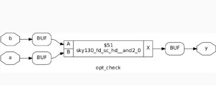

### More examples
```bash
$yosys                                                                             
yosys> read_liberty -lib ../my_lib/lib/sky130_fd_sc_hd__tt_025C_1v80.lib           
yosys> read_verilog opt_check2.v                                                     
yosys> synth -top opt_check
yosys> opt_clean -purge                                                         
yosys> abc -liberty ../my_lib/lib/sky130_fd_sc_hd__tt_025C_1v80.lib                     
yosys> show
```
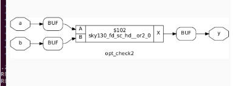

```bash
$yosys                                                                             
yosys> read_liberty -lib ../my_lib/lib/sky130_fd_sc_hd__tt_025C_1v80.lib           
yosys> read_verilog opt_check3.v                                                     
yosys> synth -top opt_check
yosys> opt_clean -purge                                                         
yosys> abc -liberty ../my_lib/lib/sky130_fd_sc_hd__tt_025C_1v80.lib                     
yosys> show
```
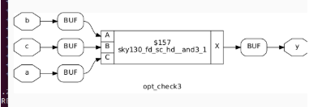

### Now an example of multiple_module_opt

```bash
$yosys                                                                             
yosys> read_liberty -lib ../my_lib/lib/sky130_fd_sc_hd__tt_025C_1v80.lib           
yosys> read_verilog multiple_module_opt.v                                                     
yosys> synth -top multiple_module_opt
yosys> flatten
yosys> opt_clean -purge                                                         
yosys> abc -liberty ../my_lib/lib/sky130_fd_sc_hd__tt_025C_1v80.lib                     
yosys> show
```
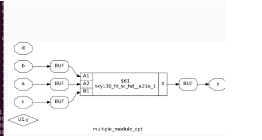


## Optimization sequential logic
In this we studied two types Basic and Advanced, in basic we did sequential constant propagation and in advanced we have cloning(physical analysis) , state optimization(optimization of unused state) , retiming.
```bash
$ iverilog dff_const1.v tb_dff_const1.v
$ ./a.out
$ gtkwave tb_dff_const1.vcd
```
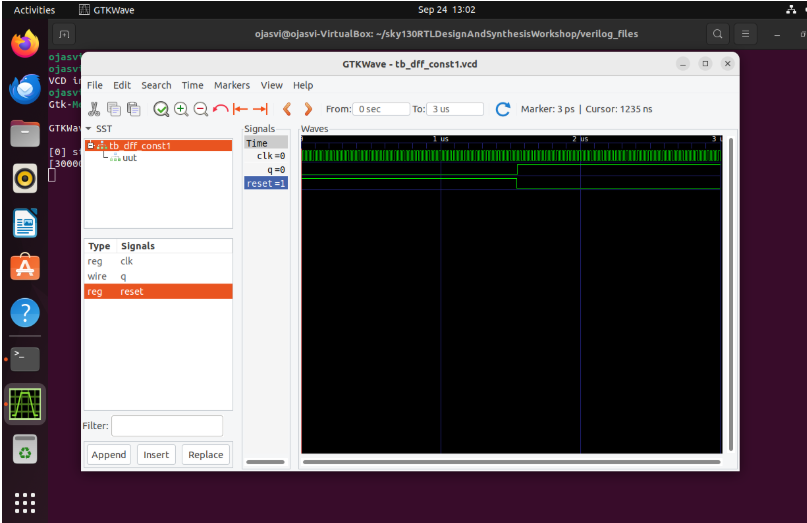

```bash
$yosys
yosys> read_liberty -lib ../my_lib/lib/sky130_fd_sc_hd__tt_025C_1v80.lib           
yosys> read_verilog dff_const1.v                                                     
yosys> synth -top dff_const1                                                         
yosys> dfflibmap -liberty ../my_lib/lib/sky130_fd_sc_hd__tt_025C_1v80.lib
yosys> abc -liberty ../my_lib/lib/sky130_fd_sc_hd__tt_025C_1v80.lib                    
yosys> show 
```
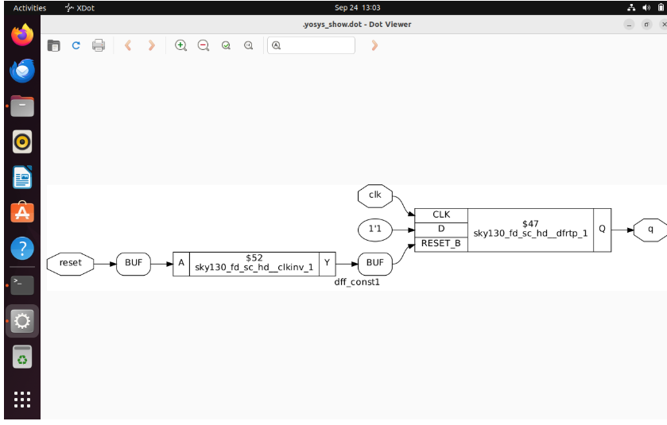

```bash
$yosys
yosys> read_liberty -lib ../my_lib/lib/sky130_fd_sc_hd__tt_025C_1v80.lib           
yosys> read_verilog dff_const2.v                                                     
yosys> synth -top dff_const2                                                       
yosys> dfflibmap -liberty ../my_lib/lib/sky130_fd_sc_hd__tt_025C_1v80.lib
yosys> abc -liberty ../my_lib/lib/sky130_fd_sc_hd__tt_025C_1v80.lib                    
yosys> show 
```
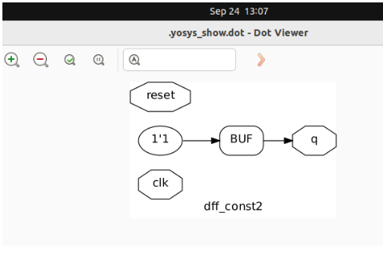

```bash
$yosys
yosys> read_liberty -lib ../my_lib/lib/sky130_fd_sc_hd__tt_025C_1v80.lib           
yosys> read_verilog dff_const3.v                                                     
yosys> synth -top dff_const3                                                         
yosys> dfflibmap -liberty ../my_lib/lib/sky130_fd_sc_hd__tt_025C_1v80.lib
yosys> abc -liberty ../my_lib/lib/sky130_fd_sc_hd__tt_025C_1v80.lib                    
yosys> show 
```
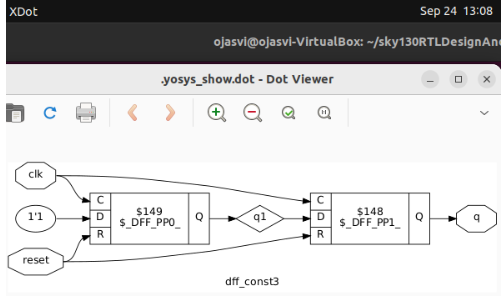

## Optimization of unused state

```bash
$yosys
yosys> read_liberty -lib ../my_lib/lib/sky130_fd_sc_hd__tt_025C_1v80.lib           
yosys> read_verilog counter_opt.v                                                     
yosys> synth -top counter_opt                                                        
yosys> dfflibmap -liberty ../my_lib/lib/sky130_fd_sc_hd__tt_025C_1v80.lib
yosys> opt_clean -purge
yosys> abc -liberty ../my_lib/lib/sky130_fd_sc_hd__tt_025C_1v80.lib                    
yosys> show 
```
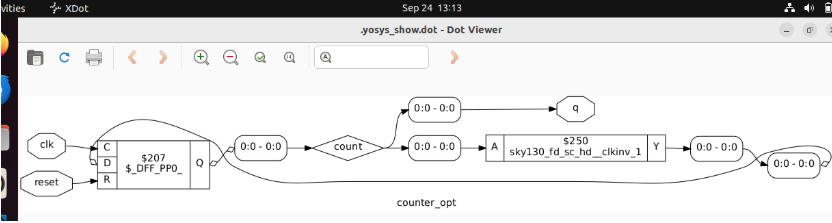

```bash
$yosys
yosys> read_liberty -lib ../my_lib/lib/sky130_fd_sc_hd__tt_025C_1v80.lib           
yosys> read_verilog counter_opt.v                                                     
yosys> synth -top counter_opt                                                        
yosys> dfflibmap -liberty ../my_lib/lib/sky130_fd_sc_hd__tt_025C_1v80.lib
yosys> abc -liberty ../my_lib/lib/sky130_fd_sc_hd__tt_025C_1v80.lib                    
yosys> show 
```
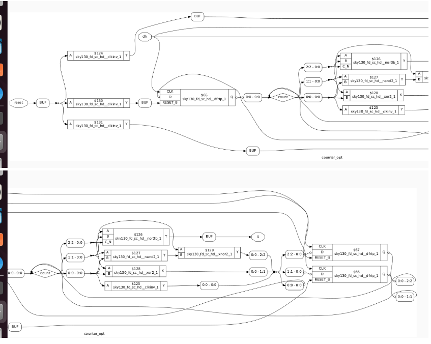

# Week1 Day4:GLS (RTL-->run-->we validate it by testing as per specifications)

### What is GLS ?
Here we run test bench with netlist as design under test. Netlist is logically same as RTL code therefore input and output nodes are same .

### Why GLS ?
Verify logic correctness of design after synthesis , insuring the timing of the design is met.
Senstivity: Change in input causes change in output. Remember to use non blocking whenever using sequential circuit.

### Ternary operator , bad mux and blocking caveat examples

### Ternary operator
```bash
$ gvim ternary_operator_mux.v -o bad_mux.v -o good_mux.v
```
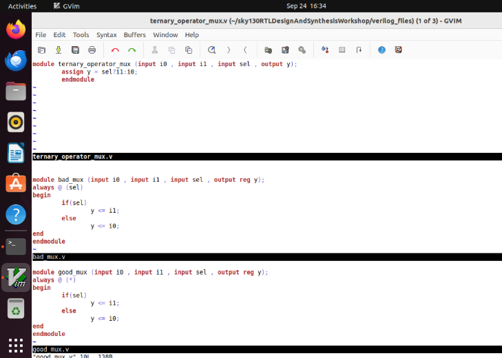

```bash
$ iverilog ternary_operator_mux.v tb_ternary_operator_mux.v.v
$ ./a.out
$ gtkwave tb_ternary_operator_mux.vcd
```
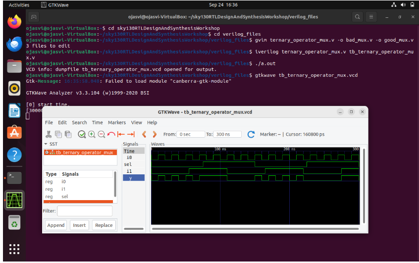

```bash
$yosys
yosys> read_liberty -lib ../my_lib/lib/sky130_fd_sc_hd__tt_025C_1v80.lib           
yosys> read_verilog ternary_operator_mux.v                                                   
yosys> synth -top ternary_operator_mux                                                      
yosys> abc -liberty ../my_lib/lib/sky130_fd_sc_hd__tt_025C_1v80.lib
yosys> write_verilog ternary_operator_mux_net.v                
yosys> show 
```
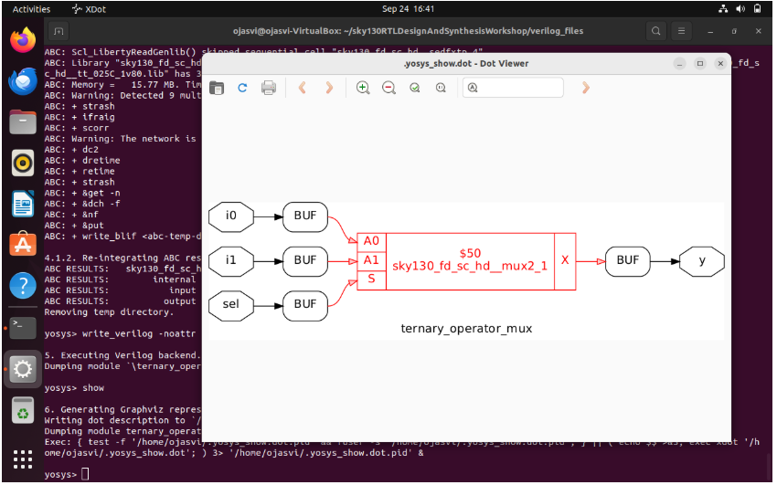

```bash
$ iverilog ../my_lib/verilog_model/primitives.v  ../my_lib/verilog_model/sky130_fd_sc_hd.v ternary_operator_mux_net.v tb_ternary_operator_mux.v
$ ./a.out
$ gtkwave tb_ternary_operator_mux.vcd
```
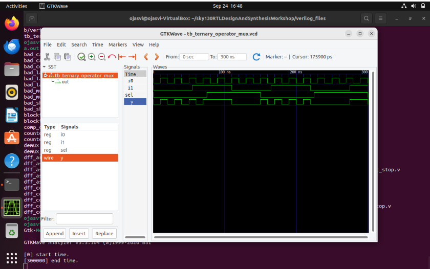

### Bad mux

```bash
$ iverilog bad_mux.v tb_bad_mux
$ ./a.out
$ gtkwave tb_bad_mux.vcd
```
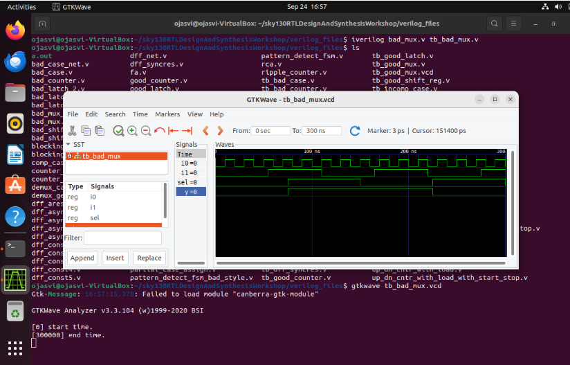

```bash
$yosys
yosys> read_liberty -lib ../my_lib/lib/sky130_fd_sc_hd__tt_025C_1v80.lib           
yosys> read_verilog bad_mux.v                                                   
yosys> synth -top bad_mux                                                     
yosys> abc -liberty ../my_lib/lib/sky130_fd_sc_hd__tt_025C_1v80.lib
yosys> write_verilog bad_mux_net.v                
yosys> show 
```
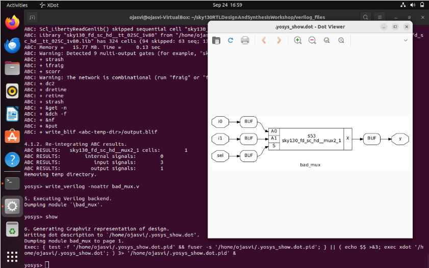

```bash
$ iverilog ../my_lib/verilog_model/primitives.v  ../my_lib/verilog_model/sky130_fd_sc_hd.v bad_mux_net.v tb_bad_mux.v
$ ./a.out
$ gtkwave tb_bad_mux.vcd
```
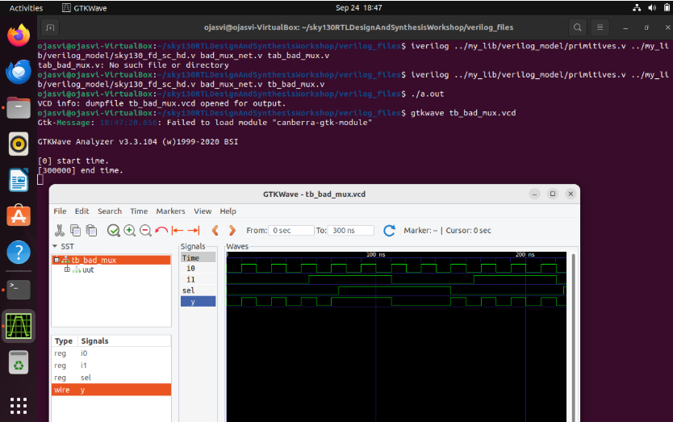

### Blocking caveat

```bash
$ iverilog blocking_caveat.v tb_blocking_caveat.v
$ ./a.out
$ gtkwave tb_blocking_caveat.vcd
```
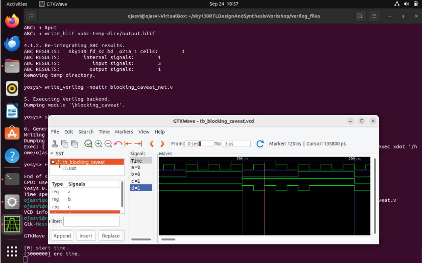

```bash
$yosys
yosys> read_liberty -lib ../my_lib/lib/sky130_fd_sc_hd__tt_025C_1v80.lib           
yosys> read_verilog blocking_caveat.v                                                   
yosys> synth -top blocking_caveat                                         
yosys> abc -liberty ../my_lib/lib/sky130_fd_sc_hd__tt_025C_1v80.lib
yosys> write_verilog blocking_caveat_net.v                
yosys> show 
```
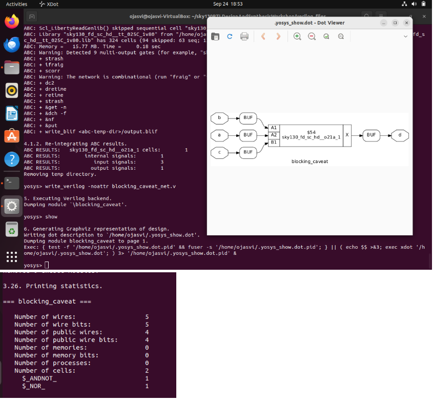


```bash
$ iverilog ../my_lib/verilog_model/primitives.v  ../my_lib/verilog_model/sky130_fd_sc_hd.v blocking_caveat_net.v tb_blocking_caveat.v
$ ./a.out
$ gtkwave tb_blocking_caveat.vcd
```
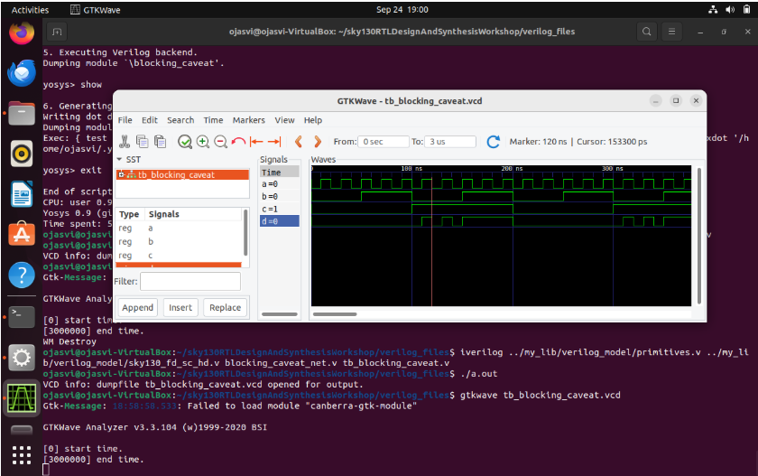

# Week1 Day5: If case , for loop & for generate statements
## IF CASE

### Incomp_if

```bash
$ iverilog incomp_if.v tb_incomp_if.v
$ ./a.out
$ gtkwave tb_incomp_if.vcd
```
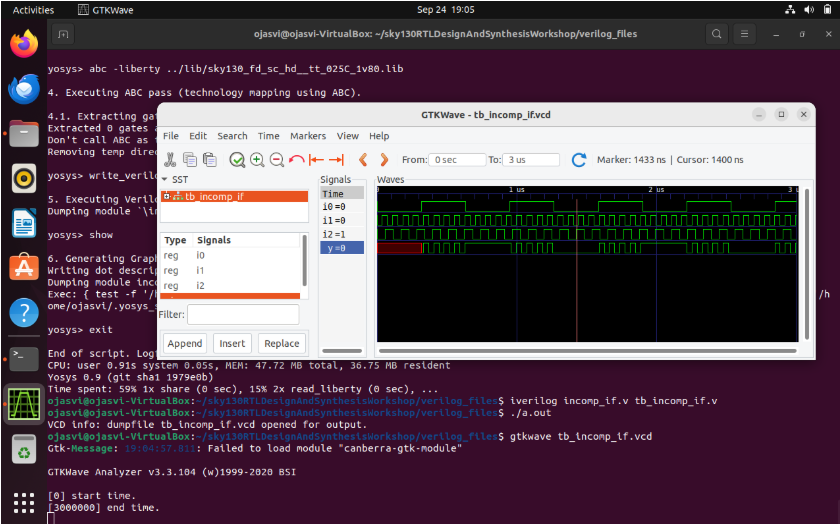

```bash
$yosys
yosys> read_liberty -lib ../my_lib/lib/sky130_fd_sc_hd__tt_025C_1v80.lib           
yosys> read_verilog incomp_if.v                                                 
yosys> synth -top incomp_if                                         
yosys> abc -liberty ../my_lib/lib/sky130_fd_sc_hd__tt_025C_1v80.lib
yosys> write_verilog -noattr incomp_if_net.v                
yosys> show 
```
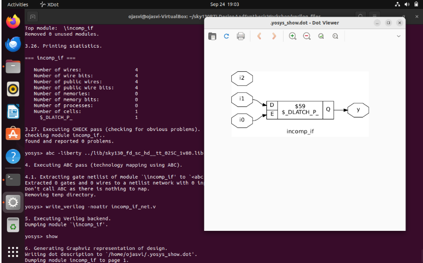

### Incomp_if2

```bash
$ iverilog incomp_if.v tb_incomp_if2.v
$ ./a.out
$ gtkwave tb_incomp_if2.vcd
```
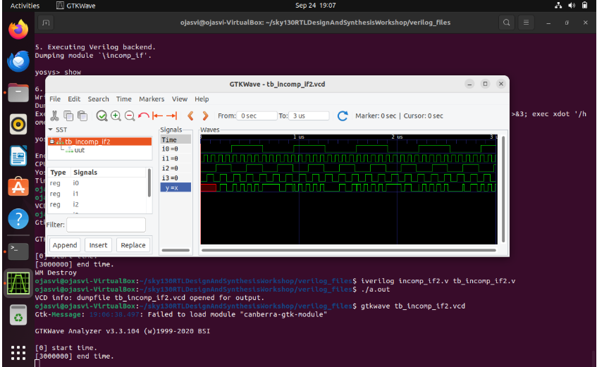

```bash
$yosys
yosys> read_liberty -lib ../my_lib/lib/sky130_fd_sc_hd__tt_025C_1v80.lib           
yosys> read_verilog incomp_if2.v                                                 
yosys> synth -top incomp_if2                                         
yosys> abc -liberty ../my_lib/lib/sky130_fd_sc_hd__tt_025C_1v80.lib
yosys> write_verilog -noattr incomp_if2_net.v                
yosys> show 
```


## CASE STATEMENTS
### Incomp_case

```bash
$ iverilog incomp_case.v tb_incomp_case.v
$ ./a.out
$ gtkwave tb_incomp_case.vcd
```
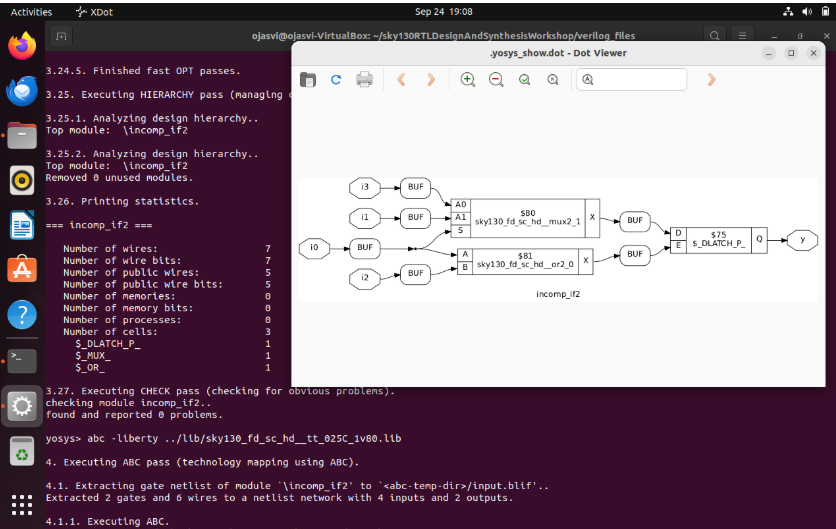

```bash
$yosys
yosys> read_liberty -lib ../my_lib/lib/sky130_fd_sc_hd__tt_025C_1v80.lib           
yosys> read_verilog incomp_case.v                                                 
yosys> synth -top incomp_case                                      
yosys> abc -liberty ../my_lib/lib/sky130_fd_sc_hd__tt_025C_1v80.lib
yosys> write_verilog -noattr incomp_case_net.v                
yosys> show 
```


### comp_case

```bash
$ iverilog comp_case.v tb_comp_case.v
$ ./a.out
$ gtkwave tb_comp_case.vcd
```
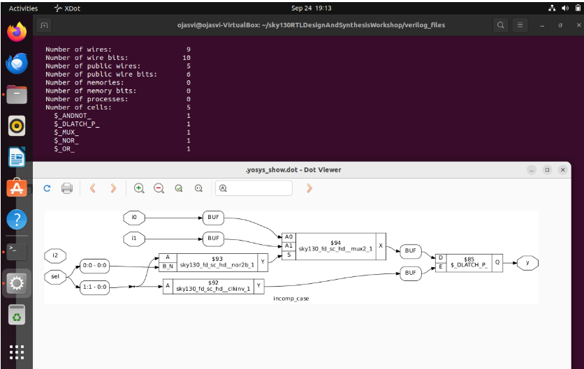

```bash
$yosys
yosys> read_liberty -lib ../my_lib/lib/sky130_fd_sc_hd__tt_025C_1v80.lib           
yosys> read_verilog comp_case.v                                                 
yosys> synth -top comp_case                                      
yosys> abc -liberty ../my_lib/lib/sky130_fd_sc_hd__tt_025C_1v80.lib
yosys> write_verilog -noattr comp_case_net.v                
yosys> show 
```
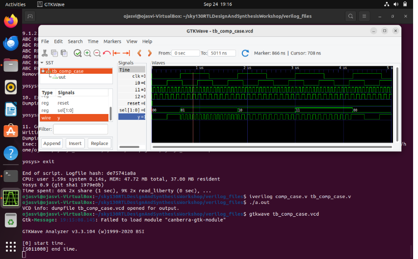

### bad_case

```bash
$ iverilog bad_case.v tb_bad_case.v
$ ./a.out
$ gtkwave tb_bad_case.vcd
```
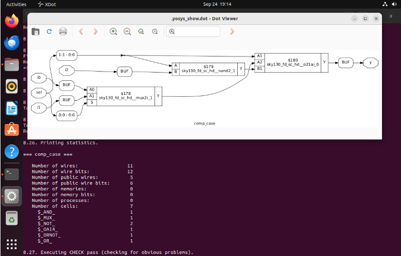

## FOR ..LOOP AND FOR ..GENERATE STATEMENTS
### mux_generate

```bash
$ iverilog mux_generate.v tb_mux_generate.v
$ ./a.out
$ gtkwave tb_mux_generate.vcd
```
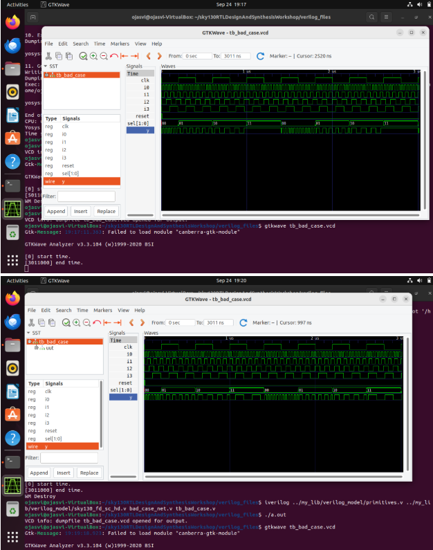

```bash
$yosys
yosys> read_liberty -lib ../my_lib/lib/sky130_fd_sc_hd__tt_025C_1v80.lib           
yosys> read_verilog mux_generate.v                                                 
yosys> synth -top mux_generate                                      
yosys> abc -liberty ../my_lib/lib/sky130_fd_sc_hd__tt_025C_1v80.lib
yosys> write_verilog -noattr mux_generate_net.v                
yosys> show 
```


## FOR ..GENERATE STATEMENTS
### fa.v rca.v
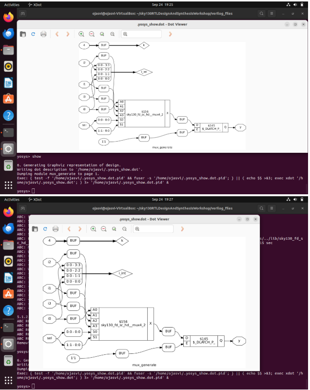

### demux_case
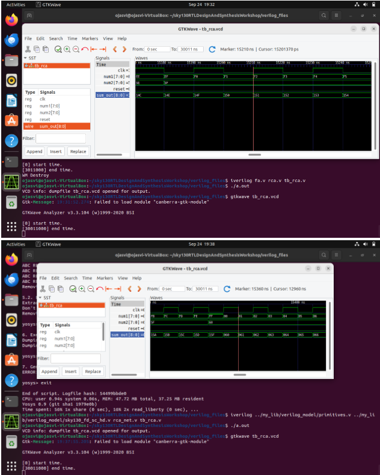
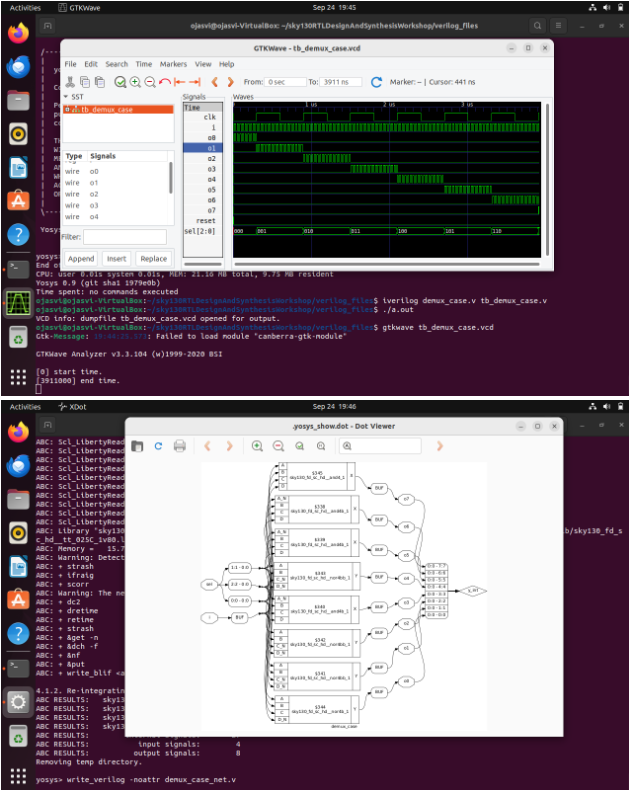

### demux_generate
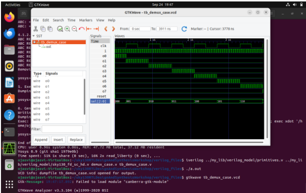
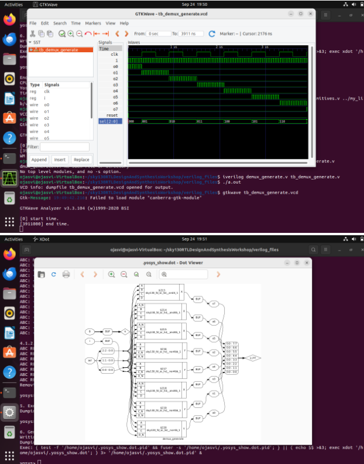


# Week 2:Day 1 BabySoC Fundamentals & Functional Modelling

### Objective : 
In week 2 we are going to build a solid understanding of SoC fundamentals and practise functional modelling via BabySoC using simulation tools (iverilog and GTKWave).

## Part 1 : Theory (Fundamentals of SoC Design) 
VSDBabySoC is an open source system on chip (SoC) based on RISC-V architecture for digital-analog interfacing. It combines RVMYTH processor , PLL , 10-bit DAC (all implemented using Sky130 technology).
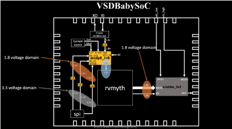

### SoC Architecture and Components
VSDBabySoC integrates digital and analog subsystems on one chip to illustrate the principles of contemporary embedded system design. The RVMYTH core serves as the processor, which processes instructions loaded into its instruction memory (imem). During reset, the PLL is turned on to produce a stable clock signal that synchronizes the whole system. This clock runs the RVMYTH processor, which computes data and cycles values in register r17. These digital values are then routed to the DAC for analog conversion into an output signal called OUT, which can be connected to external devices such as televisions or mobile phones for audio or video output.
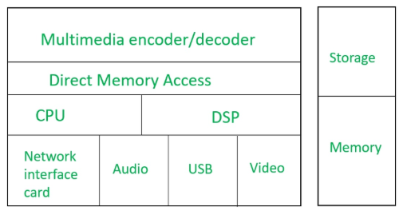
The integration of these elements is based on a methodical RTL-to-GDSII flow utilizing open-source tools such as OpenLANE, Yosys, and Magic. Modeling, synthesis, place-and-route, STA, and physical verification are part of the design process. Under simulation, the PLL creates the CLK signal, thereby facilitating sequential execution in RVMYTH, while the DAC converts 10-bit digital output (RV_TO_DAC[9:0]) into an analog waveform. For simulation constraints, analog behavior is simulated through Verilog's real data type, although synthesis on real hardware utilizes normal wire types.
### Phase-Locked Loop (PLL) Operation
The PLL of VSDBabySoC is a control system that produces an output signal in phase-synchronized and frequency-synchronized form with respect to a reference input. It includes a phase detector, loop filter, and voltage-controlled oscillator (VCO). The phase detector detects the phase difference between the input reference signal and the feedback signal and generates an error voltage proportional to it. This error is filtered by a low-pass loop filter to eliminate high-frequency noise and then fed to the VCO, which controls its output frequency until phase difference is minimized, and lock is achieved. In VSDBabySoC, the PLL multiplies the input frequency eight times, generating a stable high-speed clock for the RVMYTH processor and DAC.
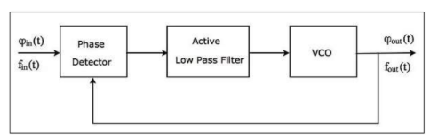
Utilization of an on-chip PLL rather than an off-chip clock source eliminates numerous challenges. Off-chip clocks are plagued by distribution delay from long interconnects, clock jitter on synchronization, and frequency variations resulting from crystal tolerance and temperature. By providing the clock internally, the PLL facilitates accurate timing coordination throughout the SoC, less external noise sensitivity, and flexible frequency scaling. This is essential for data integrity and consistent operation in mixed-signal applications where timing mismatches can ruin performance.

### Digital-to-Analog Conversion Mechanism
VSDBabySoC's 10-bit DAC translates digital signals from the RVMYTH processor into analog voltages for interfacing with the outside world. Two popular DAC structures are the weighted resistor and R-2R ladder networks. The R-2R ladder is more desirable because it is simple, scalable, and possesses in-built accuracy with only two resistor values in a recurring pattern. Each of the digital input bits drives a switch that is connected to ground or to a reference voltage to provide a binary-weighted current or voltage sum at the output. In VSDBabySoC, the DAC is driven by a 10-bit digital input (D[9:0]) and delivers an equivalent analog output (OUT), allowing continuous waveforms like sine or square waves to be generated.
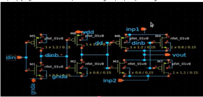
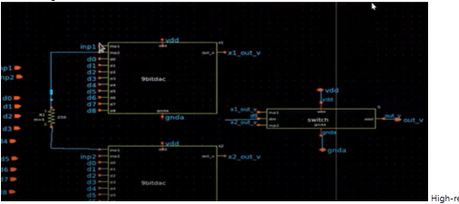
High-resolution DACs such as the 10-bit example are subject to code-dependent switching glitches and nonlinearity. These are addressed in segmented architectures, where thermometer-coded most significant bits (MSBs) are mixed with binary-weighted least significant bits (LSBs) for enhanced linearity and lower distortion. Oversampling and digital interpolation methods can also be used to ease anti-imaging filter demands and increase signal-to-noise ratio (SNR). The DAC output is buffered with operational amplifiers or RF transformers for effectively driving external loads with signal integrity.

### Design Flow and Implementation
The VSDBabySoC design is based on an end-to-end mixed-signal RTL-to-GDSII flow with open-source EDA tools. The flow starts with functional modeling and pre-synthesis simulation with Icarus Verilog (iverilog) and GTKWave waveform visualization. Once correctness is verified, the design is synthesized with Yosys, mapped to the Sky130 standard cell library, and analyzed for timing with OpenSTA. For physical implementation, place-and-route, clock tree synthesis, and power distribution are automated by OpenLANE using LEF, GDS, and LIB files for analog IP blocks such as the PLL and DAC.

As full timing models for analog IPs are not easily attainable, simplified or "fake" LIB files are created to allow synthesis and STA. The LEF and GDS files of the PLL and DAC are obtained from their layouts by using Magic, a VLSI layout tool, and added to the OpenLANE flow. Floorplaning determines macro placements and pin locations for optimal routing and congestion prevention. Post-layout simulations and STA verify timing closure with slack values as reported confirming successful design convergence. The last GDSII layout is a manufacturable design in readiness for Sky130 process fabrication.

# Week 2-Day2: Labs

## Simulation Steps:
### a) Pre-Synthesis Simulation

```bash
$ iverilog -o output/pre_synth_sim/pre_synth_sim.out -DPRE_SYNTH_SIM=1 -I src/include -I src/module src/module/testbench.v src/module/vsdbabysoc.v src/module/rvmyth.v src/module/avsdpll.v src/module/avsddac.v
$ cd output/pre_synth_sim
$ gtkwave pre_synth_sim.vcd
```
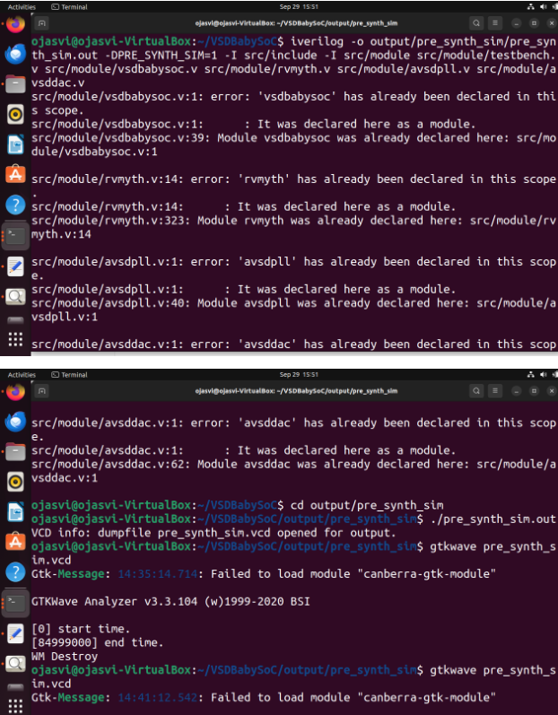

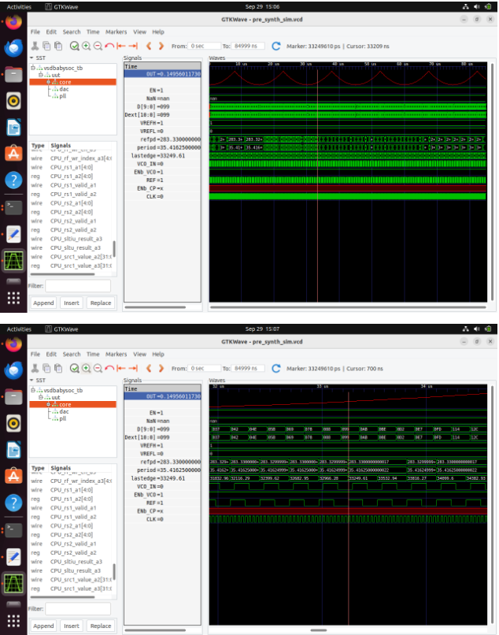


# Week3 Day1:Post-Synthesis GLS & STA Fundamentals

## Objective
This week our aim is to understand and perform Gate-level Simulation after synthesis, validate functionality and get introduced to Static timing analysis concepts with practical experiments using OpenSTA.

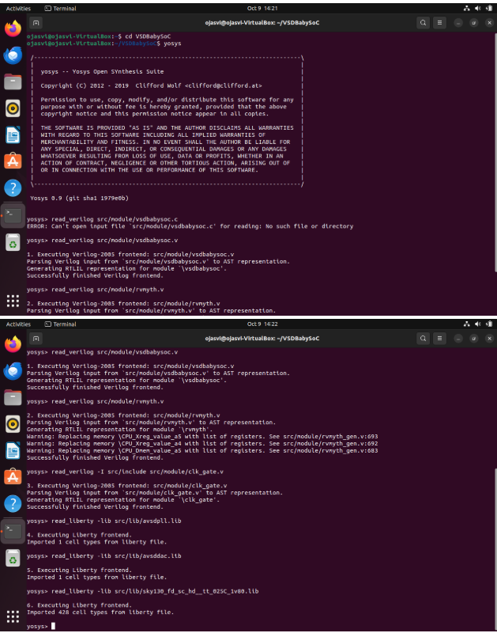
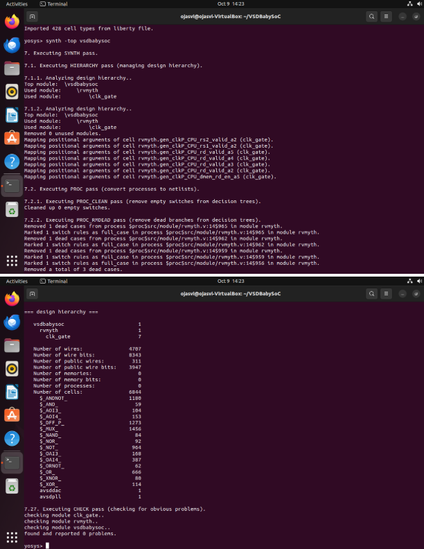

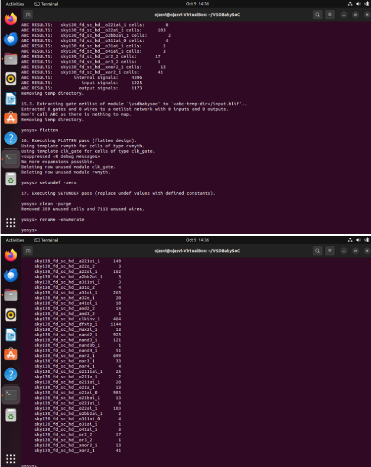


# Week3 Day2: STA


# Week 4 Task – CMOS Circuit Design (sky130-style)

## Objective
This task deepens our understanding of how transistor-level circuit properties (devicephysics, sizing, variation) drive the timing behavior that STA analyzes. By working throughCMOS design and SPICE simulations (as in the sky130 workshop), you will see the “real”side of what STA approximates. This strengthens your intuition about slack, delay, noisemargins, and variation impacts.

### Context
This comprehensive summary explores two foundational pillars of modern VLSI design: power-aware clock tree synthesis (CTS) and MOSFET device physics. The CTS section outlines a hierarchical buffering strategy that employs identical buffers at each level of the clock tree. This uniformity ensures consistent capacitive loading across all branches, enabling predictable delay propagation and minimizing timing skew. Delay characterization tables for various buffer types—such as CBUF-X, CBUF-Z, CBUF-1, and CBUF-2—illustrate how delay varies with output load and input slew, allowing designers to make informed buffer selections that balance power and performance. This methodology supports the construction of low-power, high-speed clock distribution networks by optimizing fanout and load symmetry.

Shifting to MOSFET physics, the discussion begins with the structural anatomy of an NMOS transistor, emphasizing the roles of the gate, source, drain, and substrate in channel formation. The concept of threshold voltage is introduced as the critical gate-to-source voltage required to initiate strong inversion, thereby forming a conductive channel between source and drain. A central focus is the body effect, which describes how a positive substrate bias increases the threshold voltage due to an expansion of the depletion region near the source-substrate junction. This phenomenon necessitates additional gate voltage to achieve inversion, impacting device switching behavior.

Supporting this analysis are foundational semiconductor principles, including the definition of oxide capacitance and the relationship between Fermi potential and doping concentration. These parameters influence the electrostatic behavior of the transistor and are essential for accurate modeling. The narrative then advances to the resistive operation region, where the channel exhibits a non-uniform charge distribution caused by the voltage gradient along its length. This spatial variation in charge leads to a position-dependent current flow, governed by the mobility of charge carriers and the local electric field. The resulting drain current reflects the dynamic interplay between gate voltage, threshold voltage, and channel potential.

Finally, the discussion distinguishes between two fundamental types of current in semiconductor devices: drift current, which arises from electric fields, and diffusion current, which is driven by gradients in carrier concentration. Together, these concepts provide a rigorous framework for understanding transistor behavior under bias and inform the design of energy-efficient digital systems.

## 1.This plot shows Id vs Vgs curve for nmos having width=0.375um length=0.25um
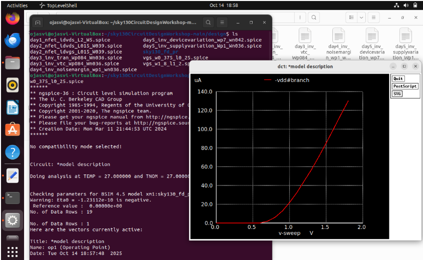
## 2.This plot shows Id vs Vgs curve for nmos having width=1.8um length=1.2um
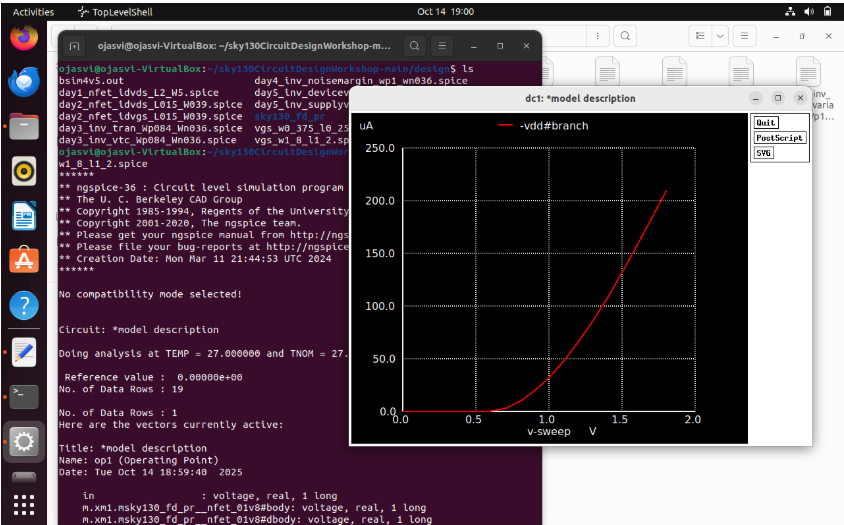
## Above plots tells that as width increases drain current increases.


## 3.This plot shows Id vs Vds curve for nmos having width=0.375um length=0.25um
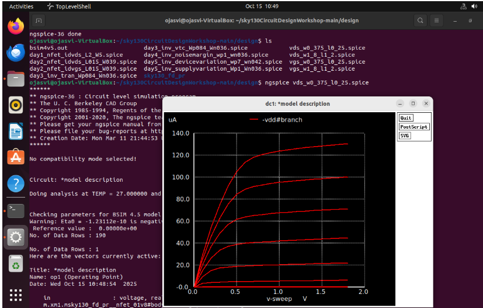
## 4.This plot shows Id vs Vds curve for nmos having width=1.8um length=1.2um
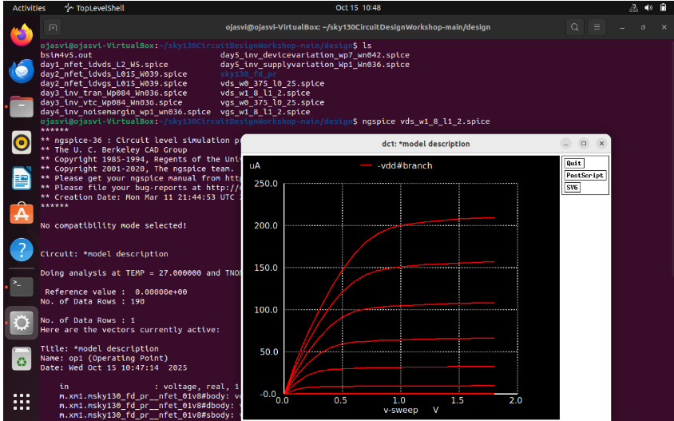

## 5.CMOS inveter where switching threshold is around=0.881148 i.e Vdd/2
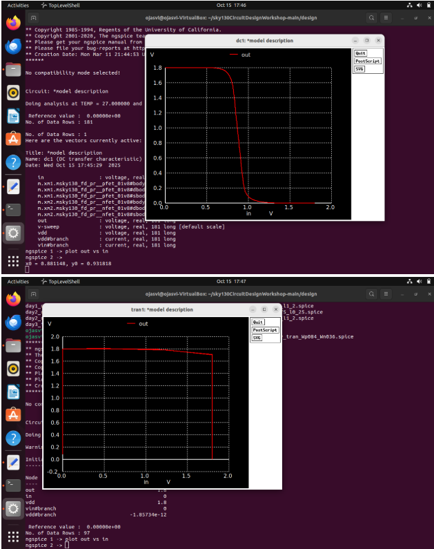

## 6.CMOS delay calculation
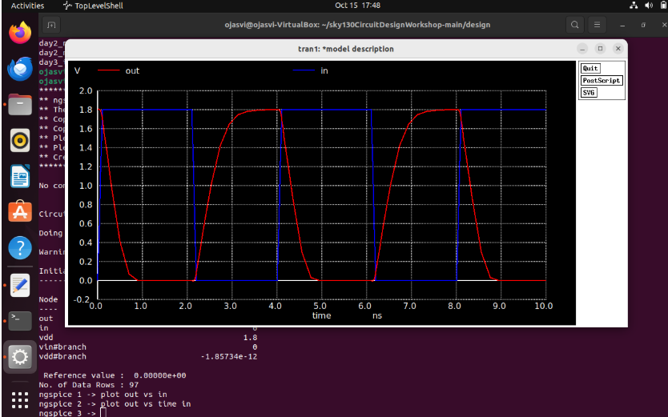
## Rise time=2.48397-2.15385=0.33012nsec
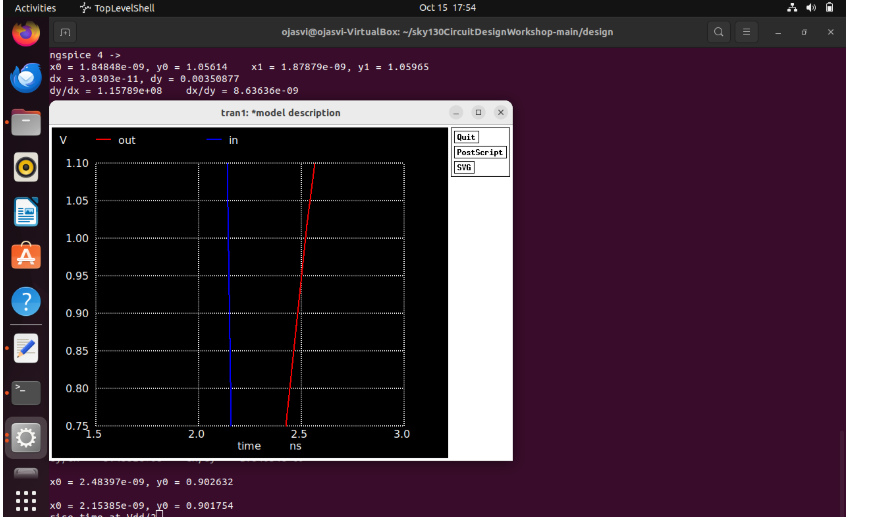
## Fall time=4.33504-4.05128=0.28376nsec
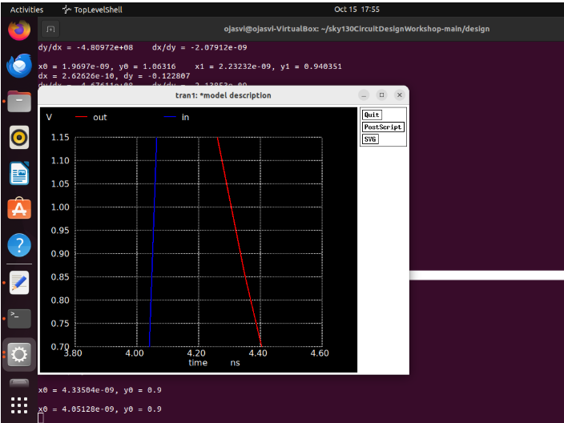

## 7.CMOS inverter having Voh=1.73182V Vil=0.762295V Vol=0.1V Vih=0.979508V
## Noise margin high=0.752312V : Noise margin low=0.662295V
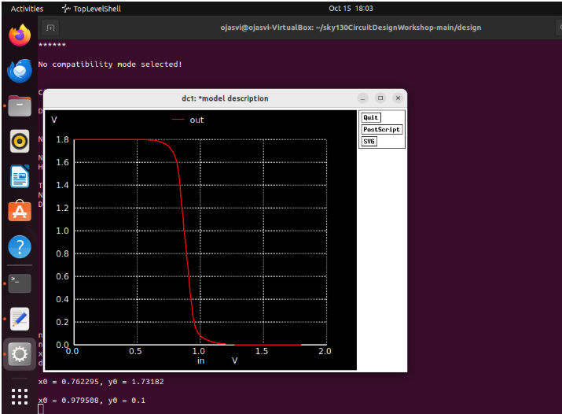

## 8. Gain(dc6)=(1.74545-0.113636)/(0.974359-0.75641)=7.487136899
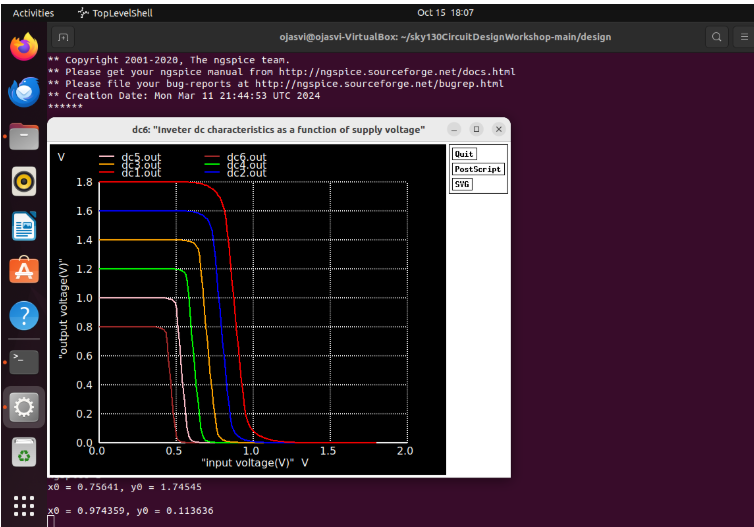
   Gain(dc5)=(1.51918-0.083636)/(0.876068-0.709402)=8.613298453
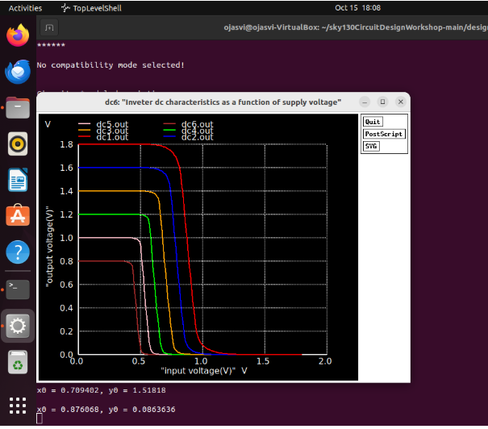
   Gain(dc4)=(1.33636-0.0681818)/(0.769231-0.645299)=9.981819982

   Gain(dc3)=(1.15909-0.05)/(0.67094-0.559829)
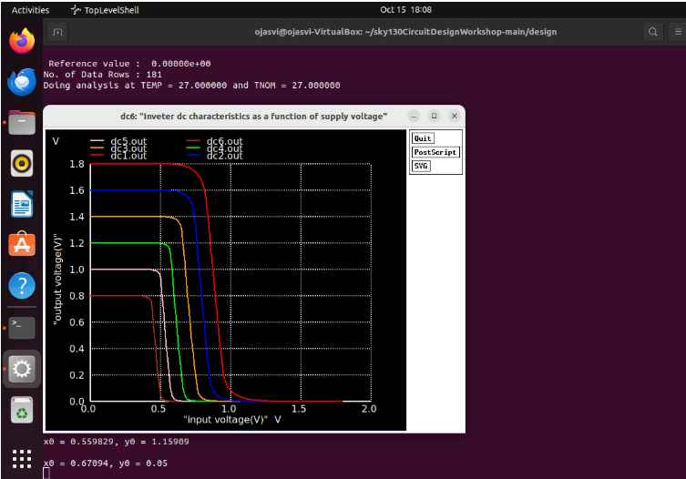
   Gain(dc2)=(0.968182-0.05)/(0.58547-0.487179)
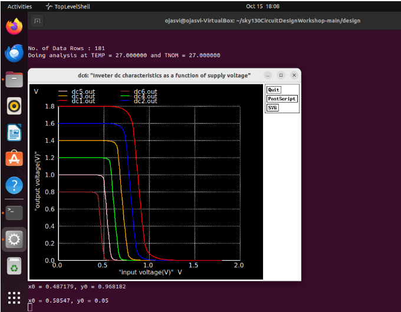
   Gain(dc1)=(0.754545-0.05)/(0.5-0.431624)
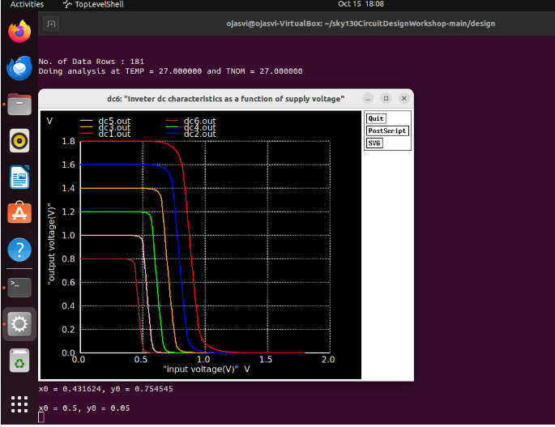

## So above observation tells gain increases as Vin and Vout decreses.
## If pfet width increased compared to nfet that means in vtc 1.8 stays staraight for longer time than gnd(device variation),strong pfet weak nfet and vm=1.8/2 should have been ideal but it is right shifted now.(Vm is 0.988)
## So therefore we say cmos is very robust
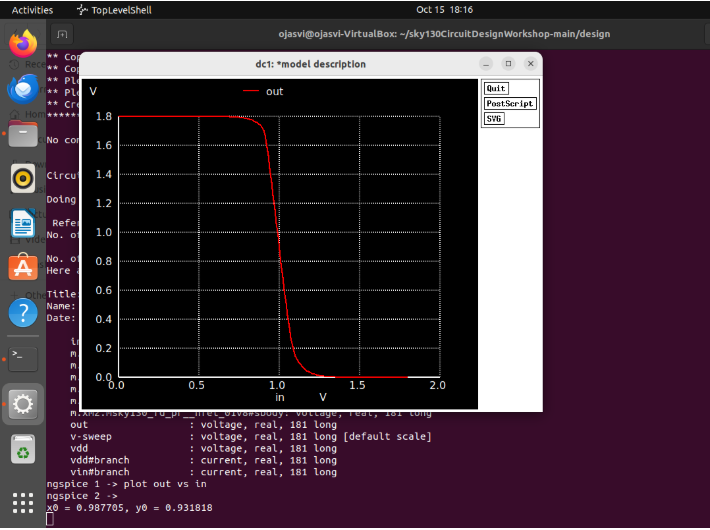

# Week5 : OpenROAD 

OpenROAD integrates several open-source tools into one streamlined flow :
   Yosys – Performs RTL synthesis and converts Verilog into gate-level representation.
   OpenROAD App – Implements placement, clock tree synthesis, and routing.
   TritonFPlan / TritonRoute – Handles floorplanning, power delivery network, and detailed routing.
   OpenSTA – Conducts static timing analysis.
   OpenRCX – Performs parasitic extraction.
   KLayout / Magic – Used for visualization and DRC/LVS verification.
   This integration creates a smooth flow from logic design to a manufacturable chip layout, referred to as RTL-to-GDSII automation

## 
We will begin with setup
```bash
git clone --recursive https://github.com/The-OpenROAD-Project/OpenROAD-flow-scripts
cd OpenROAD-flow-scripts
sudo ./setup.sh
./build_openroad.sh --local
source ./env.sh
yosys -help
openroad -help
```

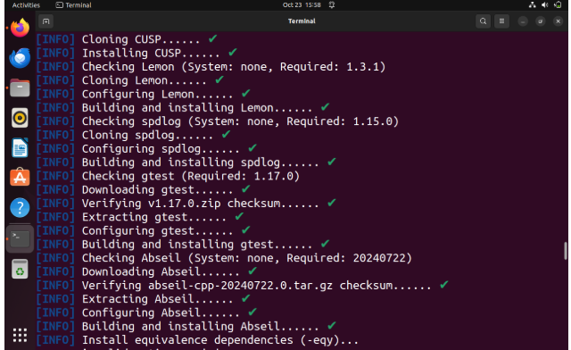
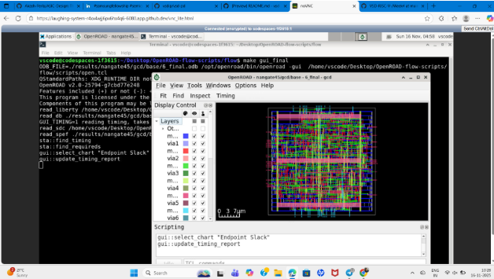

# Week 6 Task – DIGITAL-VLSI-SOC-DESIGN-AND-PLANNING
## Day1
### Introduction of open-source EDA ,OpenLANE and aky130 PDK 

How we can communicate with computer:
1. Arduino Board:
It contains an small area where chip is present that is interfaced with other pins and parts of Arduino board.The full designing of microprocessor is from RTL to GDSII flow.Arduino consist of both microcontroller and IDE which runs on computer that is then written and uploaded code to physical board.
Chip interfaces involving pads, core, and die can be understood as follows:

Pads: Pads are bonding pads on the surface of the die that serve as connection points from the chip core to the package pins. They are necessary for electrical interconnection and are accessible on the chip surface, often arranged at the periphery. Pads enable connections like power, ground, and I/O signals between the chip core and the external environment or package. Pads are not covered by passivation layers to allow wire bonding or flip-chip connections.

Core: The core refers to the internal functional circuitry of the chip, including logic and power circuits. It consumes power supplied via the pads and bump pads and is protected by insulating/passivation layers except at the pads. The core area houses the active devices that implement the intended functionality of the IC.

Die: The die is the physical piece of semiconductor material (usually silicon) on which the core circuitry and pads are fabricated. It includes the core, the bonding pads, power rings, and possible edge or corner regions dedicated to I/O or power pads. Die size and layout design consider pad placement for efficient power delivery and signal integrity. Die may have output interface blocks to connect to other dies or external devices
______________
In the context of a RISC-V SoC (System on Chip), components like SRAM, SoC cores, ADC, DAC, and SPI are examples of foundry IPs (Intellectual Properties). These foundry IPs are pre-designed and verified blocks provided by the semiconductor foundry or third-party vendors, which designers integrate into the chip design. 

The foundry IPs include standard cells, memory blocks like SRAM, analog/mixed-signal blocks such as ADCs and DACs, and interface modules like SPI controllers. All these IP blocks get physically realized on the silicon die through semiconductor fabrication processes such as deposition, photolithography, etching, and doping, performed by the foundry.

To summarize:
- Foundry IPs are modular building blocks (SRAM, ADC, DAC, SPI, SoC cores) incorporated into SoC designs like RISC-V.
- These IPs are fabricated using advanced semiconductor manufacturing techniques in the foundry.
- The foundry fabricates the complete chip die incorporating these IPs on silicon wafers using deposition, lithography, and other process steps.
______________
RISC-V is an open standard instruction set architecture (ISA) developed on RISC (Reduced Instruction Set Computing) principles at UC Berkeley. It is open-source and free to use, enabling broad adoption and customization without licensing fees.

RISC-V ISA features:

Fixed 32-bit base instructions naturally aligned; supports variable-length extensions (16-bit parcels).

Modular design with a base integer instruction set (RV32I or RV64I) and optional extensions for specific use cases.

Supports 32, 64, and planned 128-bit address spaces.

Instruction formats include R-type (register), I-type (immediate), S-type (store), B-type (branch), U-type (upper immediate), and J-type (jump).

Separate integer registers (32 in RV32I; 32 or 64 in RV64I) used for arithmetic, logic, memory access, and control.

Highly customizable for diverse applications—from embedded systems to supercomputers.

RISC-V's open and extensible architecture allows companies and developers to design processors optimized for performance, efficiency, power consumption, or application-specific requirements while using a standardized set of base instructions and extensions.

In SoC design, the RISC-V core can be integrated with other foundry IPs like SRAM, ADC, DAC, and SPI interfaces. The chip is fabricated by foundries using lithography and deposition techniques. The chip die contains the core logic (including the RISC-V CPU), arrays like SRAM, and interface circuits connected through pads on the die surface to the packaging and external pins via bond wires.

Thus, RISC-V provides a flexible and open foundation for SoC designs manufactured through semiconductor foundries, supporting scalable and custom processor implementations for diverse electronic systems.
_________
The flow from software applications to hardware execution involves multiple layers in a computer system:

1. Application Software:
   - This is the user-level software like apps running on the system.
   - These programs are written in high-level languages such as C, C++, or Java.

2. System Software:
   - The application software interacts with system software, which converts it into machine-understandable instructions.
   - Key parts of system software include the Operating System (OS), Compiler, and Assembler.

3. Operating System:
   - Manages hardware resources, handles input/output operations, memory allocation, and provides low-level system functions.
   - It acts as an interface between application programs and the hardware.

4. Compiler:
   - Takes program code from high-level languages and converts it into hardware-dependent instructions (assembly or intermediate machine code).
   - The instructions generated by the compiler depend on the specific hardware architecture.

5. Assembler:
   - Converts assembly language instructions into binary machine code (0s and 1s).
   - Machine code is the raw binary language a particular processor can understand and execute.

6. Hardware Chip:
   - The binary instructions are sent to the hardware chip, which performs operations based on those instructions.
   - The hardware executes functions like arithmetic, logic, memory access, and I/O as directed by the binary instructions.
   
In summary, the programming code is ultimately translated step-by-step to binary instructions that the hardware chip understands and executes, enabling software applications to run on physical hardware.
___________
To design a Digital ASIC (Application-Specific Integrated Circuit), key components and tools are required from the start:

- RTL Design (Register-Transfer Level):
  - RTL is an abstraction modeling synchronous digital circuits by describing the flow of signals between hardware registers and the logical operations on those signals.
  - It serves as the input design specification for synthesis tools.
  - Many open-source RTL designs are available from repositories like librecores.org, opencores.org, and GitHub.

- EDA Tools (Electronic Design Automation tools):
  - These tools are used for design, simulation, synthesis, verification, place and route, and physical verification of ICs and PCB systems.
  - Open-source EDA tools include Qflow, OpenROAD, and OpenLANE, which help automate the ASIC design flow from RTL to GDSII.

- PDK Data (Process Design Kit):
  - PDK is the interface between the fabrication foundry and IC design.
  - It includes process design rules (DRC, LVS, REX), standard cell libraries, input/output (I/O) libraries, and technology files.
  - PDKs model the actual semiconductor fabrication process used by the foundry.
  - Example: The open-source skywater 130nm PDK (sky130) widely used in academic and industry projects.
  - Advanced nodes like 5nm are costly and complex, so 130nm remains popular for many applications, delivering good speed and performance.

For example, the sky130_OSU PDK supports designs like the single-cycle RV32I RISC-V CPU core which can achieve clock speeds over 1 GHz.

Combining RTL designs, EDA tools, and PDK data enables a complete digital ASIC design flow, from high-level logic to the physical silicon layout ready for fabrication.
_________
The simplified RTL-to-GDSII (RTL2GDS) flow in ASIC design consists of the following key steps:

Step 1. Synthesis:
- Translate the RTL design into a gate-level netlist using standard cells from the cell library (SCL).
- The gate-level netlist is functionally equivalent to RTL and described in HDL and SPICE models.

Step 2. Floor/Power Planning:
- Plan the silicon area and partition the chip die into system blocks.
- Place I/O pads and define pin locations and rows in micro-floor planning.
- Construct the power distribution network with multiple VDD and GND lines using upper metal layers for low resistance and electromigration mitigation.

Step 3. Placement:
- Place the gate-level netlist cells aligned with floorplan sites.
- Global placement provides a rough arrangement considering timing and congestion.
- Detailed placement determines exact routes and layers to minimize area, power, vias, and meet timing constraints.

Step 4. Clock Tree Synthesis (CTS):
- Route the clock network to every sequential element (flip-flops, registers, ADCs, DACs).
- The clock network is typically a tree (H-tree, X-tree) designed to minimize skew using low-skew global routing resources.

Step 5. Routing:
- Connect pins physically using multiple metal layers defined by the PDK (e.g., sky130 with 6 metal layers).
- Routing grids formed by metal tracks are vast, so divide-and-conquer approaches are used.
- Two types: Global routing (generates routing guides) and Detailed routing (implements wiring based on guides).

Step 6. Sign Off:
- Final layout undergoes verification:
  - Design Rule Checking (DRC) validates geometric rules compliance.
  - Layout Versus Schematic (LVS) checks schematic and layout consistency.
  - Static Timing Analysis (STA) validates timing correctness.

The final output is a verified GDSII file, representing the physical layout ready for fabrication.
______
OpenLANE is an automated RTL-to-GDSII design flow that integrates multiple tools including OpenROAD, Yosys, Magic, Netgen, Fault, CVC SPEF-Extractor, CU-GR, and Klayout, along with scripts for design exploration and optimization. It was initiated as an open-source flow aimed at enabling true open-source tape-out experiments. 

StriVe is a family of "open everything" SoCs comprising open PDKs, open EDA tools, and open RTL designs, aligned with the open-source philosophy of OpenLANE.

The primary goal of OpenLANE is to produce a clean GDSII layout with no human intervention ("no-human-in-the-loop"). Clean means:
- No LVS (Layout Versus Schematic) violations
- No DRC (Design Rule Check) violations
- No timing violations

OpenLANE is specifically tuned for the skyWater 130nm open PDK technology and can also be used to harden macros and chips. It offers two modes of operation:
- Autonomous mode: a push-button flow that runs the entire process automatically.
- Interactive mode: allows running commands and steps one-by-one for granular control.

OpenLANE includes a large collection of example designs (43 with best known configurations) to facilitate learning and experimentation.

This flow significantly lowers the barrier to advanced ASIC design by providing a fully automated, open-source design flow for digital SoCs.
_________
The OpenLANE detailed ASIC design flow involves several key stages to ensure a robust chip design:

1. Design Exploration and Regression Testing:
   - OpenLANE runs on about 70 designs regularly, comparing results against known best results to validate improvements (CI).

2. Design for Test (DFT):
   - Performs scan insertion, automatic test pattern generation, test pattern compaction, fault coverage, and fault simulation to ensure testability.

3. Physical Implementation with OpenROAD:
   - The OpenROAD tool suite handles physical implementation with steps such as:
     - Floor and power planning.
     - End decoupling capacitors and tap cell insertion.
     - Global and detailed placement.
     - Post-placement optimization.
     - Clock Tree Synthesis (CTS).
     - Global and detailed routing.

4. Netlist Modification and Verification:
   - CTS and post-placement optimization modify the netlist iteratively.
   - Logic equivalence checking (using Yosys's LCE) confirms functional consistency after modifications.

5. Handling Antenna Rule Violations:
   - Antenna effects arise when metal wire segments collect charge that can damage transistor gates.
   - The router usually limits wire lengths to avoid violations.
   - If violations occur, bridging with higher metal layers or adding antenna diode cells help to leak charges.
   - OpenLANE proactively adds fake antenna diodes post-placement; real diodes replace them if violations are detected during antenna checking.

6. Static Timing Analysis (STA):
   - Extracted interconnect parasitics (via DEF to SPEF conversion) enable timing analysis using OpenSTA (OpenROAD).
   - This reports any timing violations.

7. Physical Verification:
   - Magic is used for Design Rule Checks (DRC) and layout-to-schematic comparisons (LVS).
   - Netgen is also used for LVS.
   - SPICE extraction validates layout versus electrical behavior.

This comprehensive flow from RTL to produced GDSII file ensures design correctness, manufacturability, and testability using open-source tools integrated within OpenLANE.
__________
Here is a summary highlighting the key points about getting familiar with open-source EDA tools and the OpenLANE directory structure, based on the provided information:

- Basic Linux commands used commonly in the workflow include `cd` (change directory), `ls` (list contents), `pwd` (present working directory), `mkdir` (make directory), `command --help` (help for commands), and `clear` (clear terminal screen).

- The working PDK variant is Sky130_fd_sc_hd:
  - "sky130" refers to the process or node name.
  - "fd" is the foundry name (SkyWater foundry).
  - "sc" stands for standard cell library files.
  - "hd" means high density variant.
  - Sky130_fd_sc_hd contains various technology files like Verilog, SPICE, techLEF, maglef, GDS, CDL, lib, LEF, etc. The techLEF files contain layer information.

- Design Preparation in OpenLANE:
  - The flow is initiated using `flow.tcl`, which runs the entire RTL-to-GDSII process.
  - Interactive mode allows step-by-step execution; otherwise, it runs fully automatically.
  - Designs are stored in the design folder (e.g., picorv32a).
  - Design folders contain files like `.scr`, `config.tcl` which has details like enrollment and clock period.
  - Time period can be set and overridden by configuration files with priority order.

- Running synthesis:
  - Preparation is completed with command `prep -design picorv32a`.
  - Synthesis is run with `run_synthesis`, which takes 3-4 minutes typically.
  - After synthesis, outputs such as the merged LEF file with wire and cell level info are generated.
  - The `results` folder populates with synthesis, placement, floorplan, routing, and verification reports.
  - The `config.tcl` file contains parameters used during the run and can be modified for changes such as core utilization.
  - Changes reflect during re-runs of floorplanning or synthesis.

- Characterizing synthesis results:
  - Data shows elements like number of D flip-flops and total cells.
  - Flop ratio is calculated as (number of flip flops) / (number of total cells).
  - The synthesis mapping is performed by ABC synthesis tool.
  - Reports with detailed statistics of synthesis are generated cd, ls, pwd, mkdir, command --help, clear.
____________
## Day2
Here is a structured summary of the key points regarding good floor planning considerations in VLSI chip design, enriched with the important source-language phrases:

In this section we will try to cover up the width and height of Core and Die. It is the first step in physical design flow to determine these dimensions. A netlist defines connectivity between elements such as flip-flops and gates. By converting symbolic gate representations to physical dimensions (e.g., standard cell dimension of 1 unit × 1 unit), overall area occupied by the netlist can be estimated on silicon wafer.

What is 'Core' and 'Die' section of a chip? The Die is the small semiconductor specimen on which the fundamental circuit is fabricated. The Core is inside the die, housing the fundamental logic of the design.

Utilization factor calculates the ratio of area occupied by netlist to the total core area. For example:

$$
\text{Utilization Factor} = \frac{\text{Area occupied by netlist}}{\text{Total area of the core}} = \frac{4 \times 1\ \text{sq. unit}}{2 \times 2\ \text{units}} = \frac{4}{4} = 1
$$

which means full utilization of the core area with no spare space left.

Aspect Ratio is the ratio of height to width. An Aspect Ratio of 1 typically means a square chip; otherwise, the shape is rectangular.

Additional examples show lower utilization factors (e.g., 0.25) which signify spare area available for additional cells or routing.

Define locations of Preplaced Cells by partitioning large combinational logic into blocks and extending input/output pins before black-boxing them as separate IP modules. This enables reuse of IPs (memory, clock gating cells, comparators, mux) across designs. Arrangement of these is known as floorplanning. Preplaced cells are user-defined placed cells that floorplan tools avoid relocating.

De-coupling capacitors are placed around pre-placed cells to supply peak switching currents. Due to resistive and inductive elements (Rdd, Ldd, Lss), voltage drops occur, so capacitors support the power supply locally. This reduces voltage droop that can cause logic errors.

Power planning involves designing power supply networks to maintain signal integrity on buses (e.g., 16-bit bus) by mitigating ground bounce and voltage drop issues. Multiple power and ground supply points (a mesh) reduce these problems.

Pin placement and logical cell placement blockage involve strategically placing input/output and clock pins to minimize resistance, especially since clock pins are typically larger for steady clock delivery. Pin areas are blocked during routing and cell placement to preserve connectivity and timing.

Overall, good floorplanning in VLSI involves balancing utilization, aspect ratio, preplaced cell positioning, power integrity with decoupling capacitors, and meticulous pin placement, setting the stage for subsequent physical design stages like placement, routing, and clock tree synthesis utilization factor, aspect ratio, Core, Die, floorplanning, De-coupling capacitors, mesh.
__________
The process to run floorplanning using OpenLANE involves several configuration and execution steps:

- Before running the floorplan, switches and settings related to floorplanning are set in configuration files. Common configurable parameters include:
  - Core utilization ratio (default 50%) and aspect ratio (default 1).
  - Power distribution network (PDN) files for power planning.
  - Pin placement modes (e.g., random but equal distance).
  - Configuration priority order: system default, config.tcl, and finally PDK variant config.

- The floorplan execution generates key layout files like the DEF (Design Exchange Format) file which describes die area dimensions and placement.

- To view the floorplan results, one opens the DEF file and corresponding LEF (layer extraction format) files using the Magic layout tool:
  - Command example:
  ```bash
  magic -T /path/to/sky130A.tech lef read ../../tmp/merged.lef def read picorv32a.floorplan.def
  ```
  - Magic lets you visually inspect input/output pin locations, metal layers used (e.g., metal 2, metal 3), decoupling capacitors (decap cells), and standard cells like buffers and logic gates.

- After floorplanning, placement binds the netlist logic gates (standard cells) to physical shapes and sizes, arranging them optimally on the floorplan.
  - Placement uses global placement first for rough positioning and then detailed placement for legality and timing.
  - Preplaced cells are locked to their locations, and no other cells overlap them.
  - Placement tries to minimize wire lengths and signal delay by placing connected elements close together.
  - Repeaters/buffers may be inserted if signals travel long distances to maintain signal integrity.

- Final placement optimization and timing analysis help verify the correctness and performance of the design in preparation for routing.

- Libraries contain standard cells with different sizes and timing characteristics used in the design, characterized via simulation and extracted layout data.

This process ensures a physically efficient and electrically sound layout for subsequent ASIC design stages like clock tree synthesis and routing.
_______
## Day3
## Library Cell Design with Magic Layout and ngspice

This guide covers the typical workflow for designing and characterizing a library standard cell (such as a CMOS inverter) using Magic layout and ngspice simulation.

## 1. **Floorplanning and IO Placement Revision**
- After initial floorplanning and placement, IO pin positions can be revised by changing parameters (e.g., `env(FP_IO_MODE)` in config files).
- Use Magic to open and visually inspect the layout; pin locations can be checked and adjusted.

## 2. **SPICE Netlist Creation for CMOS Inverter**
- **Define connectivity:** PMOS and NMOS drain, gate, source, substrate pins must connect to the correct signal nodes.
- **Component values:** Set device sizes; example—equal or different widths for PMOS and NMOS based on desired switching threshold (Vm).
- **Node assignment:** List all connection points for devices and external signals.
- **Add load capacitance:** Typically between output and ground for dynamic analysis.
- **Voltage sources:** Supply (`Vdd`) and input (`Vin`) set voltage ranges or pulse profiles.
- **Simulation commands:** For DC sweep (VTC), sweep `Vin` and observe `Vout`; for transient analysis, apply a pulse to `Vin`.
- **Model files:** Ensure correct process models for PMOS and NMOS are included for accurate device physics.

## 3. **Magic Layout Process**
- **Open layout (.mag) files:** Use Magic to design the physical geometry of the inverter.
- Use the tech file (.tech) matching your process (e.g., sky130A.tech).
- Paint layers for diffusion, polysilicon, contacts, and metals according to standard cell design rules.
- Visualize cell boundaries and layers to verify connectivity and isolation.

## 4. **CMOS Fabrication Steps Overview**
- **Active region creation:** Define areas for PMOS/NMOS, isolate with SiO₂ and Si₃N₄.
- **N-well/P-well doping:** Use masks and ion implantation for region formation.
- **Gate terminal formation:** Set appropriate doping, oxide thickness, and deposit polysilicon.
- **LDD (Lightly Doped Drain) formation:** Use spacers and selective doping to mitigate short-channel effects.
- **Source/drain formation:** Further ion implantation and high-temperature annealing for heavily doped terminals.
- **Local interconnects:** Deposit titanium, form silicide contacts, and etch to create reliable wiring.
- **Higher-level metalization:** Apply thick oxide layer (planarization), use CMP (polishing), then deposit and pattern metal for robust interconnects.

## 5. **ngspice Simulation and Characterization**
- **DC Sim (VTC):** Sweep `Vin` from 0 to `Vdd` and observe the inverter transfer curve (VTC), check switching threshold V_m  where  V_{in} = V_{out} .
- **Transient Sim:** Apply a pulse to `Vin`, measure output rise/fall times, extract delays and slew rates.
- **Impact of sizing:** Wider PMOS shifts  V_m  toward mid-point; choose sizes to optimize noise margins and robustness.

## 6. **Analysis and Optimization**
- **Switching threshold (Vm):** Critical for noise immunity; aim to keep it well within logic limits.
- **Static vs. dynamic response:** Static defines logical behavior; dynamic reveals performance (speed).
- **Cell library characterization:** Extract timing, power, noise data to enable accurate use in digital flows.

***

## Why Model Both Static and Dynamic Behavior for a CMOS Inverter?

**Static behavior** describes how the output voltage of a CMOS inverter relates to input voltage when signals are constant. This is crucial for understanding core logic functions like inversion, voltage transfer characteristic (VTC), noise margins, and the switching threshold $$ V_m $$—the input voltage where the inverter changes output state. Reliable static behavior ensures robust logical operation and noise immunity, which is vital for digital systems.
**Dynamic behavior** describes how the inverter reacts to time-varying signals, including switching speed, delay, and response to rapid changes. Dynamic analysis focuses on rise and fall times, propagation delay, and capacitance effects, which govern circuit speed and timing performance. Modeling dynamic behavior guarantees that the inverter can handle rapid signal transitions without errors or excessive delay—essential for high-speed digital circuits.
### Why are both needed?
- **Static analysis** ensures correct logical operation and voltage levels under steady-state conditions.
- **Dynamic analysis** ensures the circuit performs accurately and efficiently under real-world, time-varying operation.
- Both together provide a complete picture: a static-only model might ignore serious speed or timing limitations, while a dynamic-only model might miss logical failures or poor noise immunity.
____
Let's break down this part of the fabrication and standard cell design process:

## Metal Interconnect Formation in CMOS Fabrication

After initial transistor fabrication, forming metal interconnects is crucial for connecting devices:

1. **Barrier and Adhesion Layer:**
    - A thin layer of Titanium Nitride (TiN, about 10 nm) is deposited first. TiN acts as a very good adhesion layer for subsequent SiO₂ insulation as well as a diffusion barrier to prevent reactions between bottom (silicon) and top (metal) layers.

2. **Tungsten (W) Contacts:**
    - Next, a blanket layer of tungsten is deposited. Tungsten will fill the vias (holes) previously etched into the insulating layer, forming vertical connections (contacts) between the silicon devices below and future metal lines above.
    - Chemical Mechanical Polishing (CMP) is done to planarize the wafer surface, leaving tungsten only in contact holes.

3. **Aluminum (Al) Metallization:**
    - A layer of aluminum is deposited as the first-level metal interconnect. This forms the main horizontal wiring above the tungsten contacts that connect to the transistors.
    - Patterning (using mask 13 and photoresist) and plasma etching define these metal lines. 

4. **Additional Metal Layers:**
    - For higher-level interconnects, an insulator layer (SiO₂ or Si₃N₄) is deposited to isolate each metal level. The process of via formation, tungsten filling, metal deposition (Al), masking, and etching is repeated for each new metal level (using new masks like 14 and 15). Top metal layers (e.g., Metal 2, Metal 3, Metal 5 in SKY130) are often made thicker to reduce resistance for power and clock routing.

5. **Final Passivation:**
    - Once all routing is complete, another SiO₂/Si₃N₄ layer is deposited for passivation and protection.

***

## Sky130 Basic Layers and Layout in Magic

- **Layer Colors:**
  - Local interconnect: blue/purple
  - Metal 1: light purple
  - Metal 2: pink
  - N-well: solid dashed line
  - N-diffusion: green
  - Polysilicon: red
  - P-diffusion: brown
- These colors help visually distinguish each layer when viewing layouts in Magic or examining LEF files.

***

## Extracting and Simulating a Standard Cell

- **Netlist Extraction:**
  - In Magic's TKCON window, use `extract all` to generate extraction files.
  - Use `ext2spice cthresh 0 rthresh 0` and then `ext2spice` to create a SPICE netlist, which lists all nodes, devices (with locations), and connections—ready for ngspice simulation.

- **SPICE Simulation Setup:**
  - Include device models with `.include` lines for PMOS/NMOS LIB files.
  - Define supply and input signals:
    - Example: `VDD VPWR 0 3.3V` sets VDD to 3.3V
    - Input pulse: `Va A VGND PULSE(0V 3.3V 0 0.1ns 2ns 4ns)`
  - Add sources, analysis commands (e.g., `.tran 1n 20n`), and simulation control structure.

***

## Why Multiple Metal Levels and Vias?

- Having multiple metal layers allows complex routing without short circuits—lower metals handle local connections, upper/thicker metals carry power and long-distance signals.
- Vias (filled with tungsten) connect between these metal layers, much like elevators between floors in a building.

***
____
# Characterizing a CMOS Inverter Using Sky130 Model Files

To characterize an inverter cell with Sky130 and ngspice, follow these lab steps:

## 1. **Prepare the SPICE Netlist**
- Use **Magic** or Xschem to generate a SPICE netlist of your inverter layout or schematic.
- Make sure NMOS and PMOS gates reference correct device models (*.lib* files) from the Sky130 PDK (e.g., `nshort.lib` and `pshort.lib`).

## 2. **Include Model Files**
- At the top of your SPICE deck, add:
  ```
  .include ./libs/nshort.lib
  .include ./libs/pshort.lib
  ```
- This links the standard foundry device models to your simulation.

## 3. **Set Up Simulation Testbench**
- Connect supply and ground:
  - `VDD VPWR 0 3.3V`
  - `VSS VGND 0 0V`
- Apply a pulsed input for dynamic analysis:
  - `Va A VGND PULSE(0V 3.3V 0 0.1ns 2ns 4ns)` (customize as needed)
- Add a load capacitor if needed to model output drive (e.g., `Cload Y 0 10f`).

## 4. **Simulation Control Statements**
- For *transient (dynamic)*: 
  ```
  .tran 1n 20n
  .control
  run
  .endc
  .end
  ```
- For *DC sweep (static VTC)*:
  ```
  .dc Va 0 3.3V 0.01V
  .print dc V(Y)
  ```

## 5. **Run Simulations in Ngspice**
- Load your netlist: `ngspice inverter.spice`
- For transient, plot `V(Y)` vs time and `V(A)` vs time.
- For DC, plot `V(Y)` vs `V(A)` to get the voltage transfer characteristic (VTC).

## 6. **Extract Key Parameters**
- **Rise Time**: Time taken for output to rise from 20% to 80% of final value.
- **Fall Time**: Time taken for output to fall from 80% to 20% of initial value.
- **Propagation Delay**: Time difference between input crossing 50% and output crossing 50%.
- **Cell Fall Delay**: Measure output falling to 50% vs input rising to 50%.

### Example Measurements (from your waveform):
- Rise time  = 
  $$(2.2489-2.1819) \times 10^{-9} = 66.92$$ ps
- Fall time  = 
  $$(4.09512-4.05264) \times 10^{-9} = 42.51$$ ps
- Propagation delay = 
  $$(2.2106-2.15012) \times 10^{-9} = 60.48$$ ps
- Cell fall delay = 
  $$(4.07735-4.04988) \times 10^{-9} = 27.47$$ ps

## 7. **Noise Margins and Power**
- Find VTC extremes and transition region. Noise margins are determined at points where the slope of VTC is -1, and are critical for digital robustness.
- Measure switching current spikes to estimate dynamic power.

## 8. **LEF Generation and Integration**
- After characterization, export layout as LEF for digital integration.
- Plug into core designs (e.g., use as standard cell for larger projects).
_______
# Day4
## Pre-layout Timing Analysis & Importance of a Good Clock Tree

### What is Pre-layout Timing Analysis?
Pre-layout timing analysis is performed **before physical placement and routing**. Its main goal is to predict whether a synthesized design will meet the desired timing constraints based on logical structure and cell delays, without detailed knowledge of interconnect delays. This helps catch gross timing issues early, before layout makes fixes more difficult.

#### Main Inputs for Pre-layout STA:
- **Gate-level netlist:** Output of synthesis (structural Verilog/VHDL)
- **Timing library files (.lib):** Contain delay tables for all standard cells, generated by cell characterization (delays versus input slew and output load).
- **Constraints (.sdc):** Specify clock, I/O delays, false/multicycle paths, etc.

#### How Delay Tables Work:
- Standard cells are characterized by running many SPICE or fast modeling simulations where the input slew (rise/fall rate) and output load are varied across allowed ranges.
- The resulting delays for each input/output combination are recorded in a table (the delay table), which is stored in the **.lib** file.
- When performing STA, tools look up the actual transition and load to get the correct cell delay from the table, making timing analysis more accurate.

### Steps: Mag/LEF to Standard Cell Integration
- **LEF file extraction:** From Magic, use `lef write` to generate a cell's LEF description for digital PNR tools.
- **Port placement:** Ensure I/O pins are aligned to metal tracks as per routing requirements. Reference the process technology's `track.info` for correct spacing.
- **Integration:** Copy LEF and Liberty files to the synthesis flow, update constraints and configurations (usually in `config.tcl`), and rerun synthesis/P&R steps.

### Importance of a Good Clock Tree
A clock tree distributes the clock signal to all sequential elements (flip-flops, latches, etc.) in the chip. Its quality directly impacts:
- **Clock skew:** The time difference in clock arrival at different elements. High skew can cause functional errors, setup/hold violations, and reduce the chip's operating frequency.
- **Clock latency:** Delay from the clock source to end points.
- **Power consumption:** Efficient clock gating and buffer insertion can save substantial dynamic power.
- **Jitter:** Excessive noise/variation in clock edges harms reliable operation.

Good clock tree synthesis (CTS):
- Minimizes skew and latency via balanced path construction (often H-tree or similar)
- May implement clock gating for power-aware design, using AND/OR gating logic to enable portions of the clock tree only when needed
- Balances load capacitances by even buffer and wire distribution, as reflected in delay tables
______

Let's walk through how **delay tables** are used for practical buffer delay calculation:

## Step-by-Step Delay Look-Up and Extrapolation

1. **Identify input transition and output load:**
   - Your buffer1 has an input transition (slew) of 40 ps and output capacitive load of 60 fF.
   - You consult the delay table from the cell's Liberty (.lib) file for these values.

2. **Delay table interpolation/extrapolation:**
   - Delay tables typically have a grid of (input slew × output load) with corresponding delays (e.g., entries x9, x10, etc.).
   - If (40 ps, 60 fF) lies between two grid points, you interpolate or (if outside) extrapolate along the grid to estimate the delay. This gives an accurate value from characterization, bridging the gaps for missing points.

3. **Calculating next buffer delay:**
   - Buffer2 uses the same transition (60 ps) and output load (50 fF), so you look up its delay (e.g., y15) similarly in the corresponding cell delay table.

4. **Total delay and skew:**
   - Add up stage delays: total delay = x9' + y15.
   - By ignoring wire delays and making loads identical, output clock paths are matched and skew is zero.
   - If loads differ across outputs in a clock tree, skew arises because delays are not matched.

## Key Concepts:
- **Delay tables** model how buffer/gate delay depends on BOTH input signal speed (slew) and output connected capacitance (load).
- **Interpolation/extrapolation** methods fill in for real conditions not tabulated, ensuring practical timing coverage.
___________
## Introduction to Clock Jitter and Uncertainty

**Clock jitter** is the temporary, unpredictable variation in the timing of clock signal edges compared to their ideal positions. In digital circuits, the clock should ideally switch at precise, regular intervals (like 0 ns, 1 ns, 2 ns, etc.), but due to factors such as noise, power supply fluctuations, and imperfections in clock generators (like PLLs), the signal edges can arrive slightly earlier or later than expected. This deviation is called jitter.

**Types of clock jitter include:**
- **Period Jitter:** Variation in the length of individual clock cycles compared to the ideal period (e.g., one cycle is 1.01 ns, next is 0.99 ns).
- **Cycle-to-Cycle Jitter:** Difference in period between two adjacent cycles.
- **Phase Jitter:** Short-term variations in the phase of the clock signal.
- **Duty Cycle Distortion:** Variation in the high and low times of the clock pulse.

**Clock uncertainty** is a timing margin added in static timing analysis (STA) to account for the combined effects of jitter and clock skew (differences in clock arrival across the chip).

**Impact on digital designs:**
- Jitter reduces timing margins, which can lead to setup and hold violations at flip-flops and latches.
- It can cause synchronization failures, errors in data capture, and degraded signal integrity, especially in high-speed or synchronous systems.
- When you do timing analysis, this uncertainty means the combinational delay between registers must satisfy: $$ \theta < (T - S - US) $$, where:
  - $$ \theta $$ is the total combinational delay
  - $$ T $$ is the clock period
  - $$ S $$ is the setup time
  - $$ US $$ is the uncertainty (from jitter, skew, etc.)

**Practical Design Considerations:**
- Designers measure and budget clock jitter, aiming to keep it as low as possible through careful PLL design, low-noise power supplies, and clock routing.
- In STA tools (like OpenSTA), you add clock uncertainty to ensure the design remains robust even in the presence of jitter and skew.
_________
# Lab Steps: Optimizing Synthesis to Reduce Setup Violations

To minimize setup time violations during synthesis in OpenLANE, you can adjust synthesis parameters and apply targeted timing ECOs (Engineering Change Orders). Here's a practical, step-by-step approach:

## 1. **Adjust Synthesis Parameters for Fanout and Sizing**
- Limiting maximum fanout helps prevent cells from driving too many loads, which increases delay and setup violations.
- Example commands:
  ```
  prep -design picorv32a -tag <your_tag> -overwrite
  set lefs [glob $::env(DESIGN_DIR)/src/*.lef]
  add_lefs -src $lefs
  set ::env(SYNTH_SIZING) 1     ;# Enables cell sizing
  set ::env(SYNTH_MAX_FANOUT) 4 ;# Sets max fanout to 4
  run_synthesis
  ```
  After synthesis, run static timing analysis (STA) with your timing constraints using:
  ```
  sta pre_sta.conf
  ```

## 2. **Analyze Slack and Fanout after Synthesis**
- Check STA results: Look at Worst Negative Slack (WNS) and Total Negative Slack (TNS) for setup violations.
- If you see negative slack, investigate which gates and nets are causing the largest delays (often those with high fanout or insufficient drive).

## 3. **Timing ECO: Increase Cell Drive Strength Where Needed**
- Use OpenLANE commands to identify cells under heavy load and replace them with stronger variants.
- Steps:
  1. **Report net connections:**
     ```
     report_net -connections <net_name>
     ```
  2. **Replace weak cells:**
     ```
     replace_cell <cell_instance> <new_stronger_cell>
     # Example: replace_cell _14510_ sky130_fd_sc_hd__or3_4
     ```
  3. **Check timing improvement:**
     ```
     report_checks -fields {net cap slew input_pins} -digits 4
     ```
- Increasing gate drive strength reduces delay on high-fanout nets, improving setup slack.

## 4. **Repeat Synthesis and STA as Needed**
- Iterate by tuning parameters like fanout, cell sizing, or drive strength until WNS and TNS are within acceptable limits (positive slack is the goal).

## 5. **Floorplan, Place and Re-run Timing Analysis**
- After improving synthesis, proceed with floorplanning, placement, and further timing analysis. Sometimes violations are fixed during later physical stages due to improved buffer insertion and routing.

# Clock Tree Synthesis: TritonCTS and Signal Integrity

## What Is Clock Tree Synthesis (CTS)?
Clock Tree Synthesis (CTS) is the process of distributing the clock signal from its source (such as a PLL or input port) to all clocked sequential elements (flip-flops, latches, etc.) in a chip, aiming for **minimum skew** and **minimum latency**. Skew is the arrival time difference between clock endpoints, and minimizing it is crucial for meeting setup and hold time requirements reliably.

### TritonCTS Overview
In the OpenROAD EDA suite, TritonCTS is the module for automated clock tree synthesis. It constructs the clock network by:
- Building a hierarchical tree (often using H-tree algorithms for symmetry and balance)
- Inserting buffers for drive strength and signal quality
- Routing the clock nets and performing optimization to minimize skew, insertion delay, and electrical violations (e.g., max transition, max capacitance, and max fanout).

**Commands in OpenROAD:**
- `clock_tree_synthesis`: Run CTS on your current design netlist using TritonCTS, with options to select buffer cells, routing layers, clustering methods, and more.

## H-Tree Algorithm for Clock Routing and Buffering
The H-tree topology is widely used to ensure equal clock path lengths from the clock source to each endpoint, which helps keep skew near zero. Each division of the tree creates midpoint "tap" points, distributing the signal broadly and symmetrically. Buffers are placed along clock routes to maintain sharp transitions and to drive the capacitive load effectively—especially over long distances.

### Clock Buffers and Repeaters
- **Purpose:** Restore the shape of the clock signal after it is degraded by interconnect resistance/capacitance (RC effects).
- **Special Clock Buffers:** For clock networks, buffers are chosen with balanced rise/fall time and adequate drive strength.
- **Buffer Placement:** Properly spaced along wires by CTS tools; allows preservation of low skew and fast clock edges.

## Signal Integrity: Clock Net Shielding
Signal integrity on clock nets is critical because:
- **Glitch Risk:** Crosstalk can induce glitches on the clock net, potentially causing timing errors or unwanted transitions.
- **Delta Delay (Crosstalk Delay):** Capacitive coupling with nearby "aggressor" nets can alter clock delays, changing arrival times and increasing skew.

**Shielding Techniques:**
- Grounded wires (or VDD wires) are run alongside critical clock nets to reduce capacitive coupling, thus protecting the clock from signal interference and minimizing delta delay.
- Shield wires do not switch, breaking the coupling path and preventing most crosstalk-induced delay or glitches.

## Steps to Run CTS Using Triton in OpenROAD
1. **Replace netlist with synthesized, timing-optimized version** (reduce slack, fix drive strength issues as needed).
2. **Run floorplan and placement** to position the cells physically.
3. **Run `clock_tree_synthesis` to invoke TritonCTS:**
    - Select buffer cells, clustering, tap points, and wire layers via options and configuration files.
    - TritonCTS uses on-the-fly characterization and can set RC parameters directly.
    - H-tree or other balancing algorithms route the clock tree.
    - Net shielding options can be enabled/configured to further protect clock nets if required.
4. **Post-CTS outputs:**
    - Updated netlist and DEF for routed clock tree
    - Skew/latency/timing reports
    - Electrical rule violation checks

# Running Synthesis, Floorplan, Placement, and CTS in OpenLANE

Here's what happens step-by-step in your flow, plus how to verify and analyze the clock tree after CTS:

## 1. **Synthesis, Floorplan, and Placement**
- Run design preparation, synthesis, floorplanning, IO placement, and cell placement using your sequence of commands. For synthesis, set strategies like `DELAY 3`, sizing, and custom LEF inclusion as shown.
- After these steps, your netlist is optimized for timing and area, and the cells are positioned.

## 2. **Clock Tree Synthesis (CTS) with TritonCTS**
- After placement, run `run_cts` to perform clock tree synthesis using TritonCTS in OpenROAD. TritonCTS builds a balanced tree (often H-tree or similar), inserts buffers, and routes the clock net to minimize **skew**.
- If you get an error related to libraries, you can clear the env variable with `unset ::env(LIB_CTS)`.

## 3. **Verifying CTS with OpenROAD**
- Start OpenROAD in the directory where your LEF and DEF files exist:
  ```bash
  openroad
  read_lef ./runs/02-04_05-27/tmp/merged.lef
  read_def ./runs/02-04_05-27/results/cts/picorv32a.cts.def
  write_db pico_cts.db
  ```
- This creates a database file (`pico_cts.db`) you can use for later flow steps or debugging.

## 4. **Clock Tree Visualization & Timing Analysis**
- You can visualize the synthesized clock tree in tools that support it, or use OpenROAD's built-in reports:
    - `report_cts` lists clock roots, buffers, subnets, sinks inserted.
    - In the GUI, use the Clock Tree Viewer to observe clock paths and inserted buffer cells.

## 5. **Timing Analysis after CTS**
- Run STA (using OpenSTA or the OpenROAD flow) with a real clock. With buffers and wires, the clock doesn’t arrive at all registers at exactly the edge (t=0), so you must account for clock propagation delays, skew, and uncertainty.
- For a timing path:
    - **Setup analysis:** Arrival time is now (θ + Δ₁), required time is (T + Δ₂ - S - US), so slack = (required - arrival).
    - **Hold analysis:** The hold condition becomes (θ + Δ₁) > (H + Δ₂).
    - **Skew** is the difference Δ₁ - Δ₂ (arrival time disparities between endpoints).
    - Positive slack means the design meets timing; negative slack signals a setup or hold violation.

## 6. **Summary and Signal Integrity**
- Clock tree tools like TritonCTS automatically cluster sinks, select buffer types, and adjust wire routing parameters to minimize skew, latency, and violations.
- You can further configure CTS in OpenROAD with `configure_cts_characterization` (to set max slew/capacities) and `clock_tree_synthesis` options, including buffer lists, root buffer, sink clustering, and more (see documentation for full parameter lists).
- Clock shielding, careful buffer placement, and balanced trees ensure signal integrity and robustness against glitches, crosstalk, and delay.

## Hold Timing Analysis with Real Clocks

Hold timing analysis ensures that data launched by a flip-flop on one clock edge is held long enough so it is reliably captured at the downstream (capture) flip-flop on the same clock edge. With real clock trees, this means accounting for delays due to buffers, routing, and uncertainty in the clock network.

The critical condition for **hold time** is:
$$
\text{Combinational delay} + \Delta_1 > \text{Hold time} + \Delta_2
$$
where:
- $$\Delta_1$$: Clock network delay to the launch flip-flop
- $$\Delta_2$$: Clock network delay to the capture flip-flop
- $$\text{Hold time}$$: Minimum time for which data must be stable at capture flop
- $$\text{Combinational delay}$$: Circuit delay between the launch and capture flop

**Clock Uncertainty** — due to jitter or variation in clock edges — must also be considered, but it's generally equal for both launch and capture flops when the clock edge is the same. Adding uncertainty to the required time increases robustness.

**Slack** for hold is:
$$
\text{Slack} = (\text{Data arrival time}) - (\text{Data required time})
$$
Slack should be positive or zero. **Negative slack** indicates a violation and means the path is too fast: data may be captured before it becomes stable.

***

### How to Analyze Hold Timing Using OpenSTA (OpenROAD)

1. **Prepare and Load the Design:**
    - `read_db pico_cts.db`
    - `read_verilog <netlist_post_cts>`
    - `read_liberty <timing_library.lib>`

2. **Link and Apply Constraints:**
    - `link_design picorv32a`
    - `read_sdc <constraints.sdc>`
    - `set_propagated_clock [all_clocks]`  # Ensures clock delays are included from buffers/wires

3. **Report Hold Timing and Skew:**
    - `report_checks -path_delay min_max -fields {slew trans net cap input_pins} -format full_clock_expanded -digits 4`
    - `report_clock_skew -hold`  # Shows maximum clock arrival difference between flip-flop pairs for hold

Analysis will show which paths have very small delays and could be at risk for hold violations — especially as buffer delays or clock skew change. Larger buffer drive and proper clock tree tuning help mitigate hold issues by balancing clock arrival times and making sure each path has adequate delay.
_________________
# Day5
## Final Stage: RTL2GDS – Routing (TritonRoute) and DRC

### 1. **Overview of Routing**
- **Routing** is the process in ASIC physical design where electrical connections are made between all required pins or nets using physical wires on the chip. The goal is to find the shortest, least congested, and rule-compliant paths between the source and target locations on a defined routing grid, following manufacturing constraints.

### 2. **Maze Routing – Lee’s Algorithm**
- **Lee’s Algorithm** (Maze Routing) is a fundamental method used in both global and detailed routing steps. It operates on a grid representing the chip area, with obstacles (like cells and existing wires) marked as forbidden regions. The key steps are:
  - **Label Expansion:** Starting from the source cell, the algorithm expands a wavefront to adjacent grid points (not diagonals). Each new cell is labeled with its distance from the source.
  - **Breadth-First Search:** This expansion continues until the target cell is reached or all possibilities are exhausted, ensuring an optimal (shortest) path is found.
  - **Backtrace Path:** Once the target is reached, the best path is traced back from target to source, using the labels.
- Lee’s Algorithm is robust and guarantees to find the shortest valid path (if one exists), handling obstacles and congestion. However, it can be slow for large, dense grids, which is why enhanced algorithms (Steiner, A*-based, etc.) are sometimes used for more efficiency.

### 3. **Design Rule Check (DRC)**
After routing, all wires and vias must adhere to foundry and PDK rules:
  - **Wire Width:** Each wire must be at least the minimum width allowed by the process.
  - **Wire Pitch and Spacing:** Minimum distance between adjacent wires to prevent shorts/crosstalk.
  - **Via Width & Spacing:** Vias (vertical connections between layers) have similar minimums to ensure reliability.

Violation of these rules is caught during the DRC (Design Rule Check) stage. All violations must be resolved before tape-out.

### 4. **Power Distribution Network (PDN) Routing**
- Power (VDD) and ground (GND) are distributed using an organized network of horizontal and vertical metal tracks (often called "power straps" and "rings").
- Power is delivered from the I/O pads to the power rings, then through a grid structure to all standard cell rows, ensuring voltage integrity across the chip.
- In OpenLANE, `gen_pdn` automates PDN grid generation.

### 5. **TritonRoute: Global and Detailed Routing**
- **Global Routing**: Divides the chip into coarse grid cells and assigns which grid cells should be used for each net. It provides a guide but not precise wire locations.
- **Detailed Routing**: Refines the guides into actual wire/via placements, producing a legal, DRC-clean final layout. TritonRoute is the tool in OpenROAD/OpenLANE for this step.

### 6. **Post-Routing: Parasitic Extraction**
- After routing, all wire and via resistance and capacitance values are extracted, as these affect signal delay, power, and noise. The extracted parasitics are used for signoff timing analysis (e.g., via OpenSTA).

### **Summary Table: Key Routing & DRC Concepts**
| Step             | Purpose                                                |
|------------------|--------------------------------------------------------|
| Routing Grid     | Discretizes the routing space for algorithms           |
| Lee's Algorithm  | Finds shortest valid path (L/Z-shape, least detour)   |
| DRC              | Checks wire/via width, pitch, spacing post-routing     |
| PDN              | Connects VDD/GND throughout the chip efficiently      |
| Parasitic Extract| Quantifies resistance and capacitance for timing signoff|

# Routing in OpenLANE: TritonRoute and Key Steps

## 1. **Routing Process Overview**
Routing in digital ASIC design connects the logical nets (signals) physically using the available metal layers.
- **Global routing** (FastRoute): divides the chip into rectangular grid cells and determines a coarse route for each net.
- **Detailed routing** (TritonRoute): assigns precise metal/via locations, ensuring design rule compliance and connectivity, from the guides established by global routing.

## 2. **TritonRoute Features & Routing Topology**
- TritonRoute honors pre-processed route guides (from global routing).
- Each standard cell pin is overlapped by a guided region, ideally placed at intersections of vertical/horizontal tracks for easier routing.
- Routing happens both **intra-layer** (parallel panel routing within a layer) and **inter-layer** (sequential between metal layers). Panels, even/odd indexes, and parallel assignment improve efficiency.
- **Access Points (AP):** on-grid locations where nets can transition between layers, connect to pins, or IO ports. **Access Point Clusters (APC):** groups of all APs tied to a segment, guide, or port.
- The routing algorithm calculates costs for all APCs and constructs a minimum spanning tree to optimize wirelength and via count.

## 3. **Handling Routing Constraints and Rule Checking**
- After routing, all connections are checked against Design Rules:
  - Minimum wire width, pitch, and spacing
  - Via width and spacing
- Passes only if physical connections do not violate any manufacturing constraints.

## 4. **Power Distribution Network (PDN) Integration**
- The PDN file (e.g., `17-pdn.def`) contains both clock tree and power network data, generated before routing. Power is delivered from pads through tracks/rings to standard cells via vertical/horizontal grid networks.

## 5. **Routing Configuration and Customization**
- You can change routing types or behavior via OpenLANE's `set` commands, referring to available switches in the directory's README.md under the routing section.
- Typically, default routing settings are sufficient, but for special cases (high congestion, advanced via usage, custom directions), these can be tuned.

## 6. **Post-Routing: Parasitic Extraction and STA**
- After routing, parasitic resistance/capacitance is extracted (outside OpenLANE, e.g., SPEF format) for signoff timing analysis.
- Timing verification with real parasitic data ensures all delays, signal integrity, and setup/hold checks are met before tapeout.

***


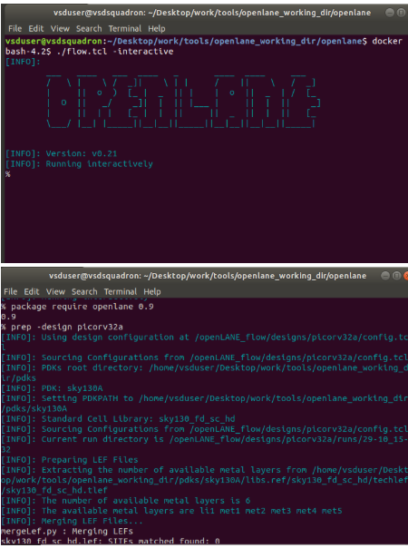
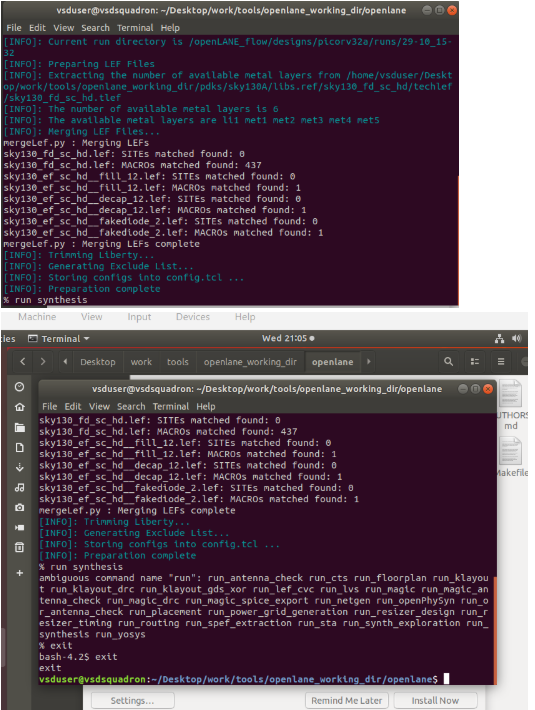
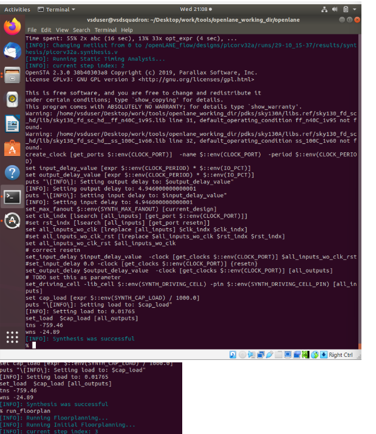


# Week 7 Task – BabySoC Physical Design & Post-Route SPEF Generation

Historical Foundations: Computing Hardware Evolution
Powerful computing began with innovations like the Bombe (mechanical cryptography), ENIAC (first general-purpose digital computer), and EDVAC (stored-program architecture). Each represented a leap in logic complexity and design automation—moving from manual wiring to programmable logic, and setting the template for all later digital systems.

Bombe: Logic-focused, mechanical, targeted problem-solving.

ENIAC: Reconfigurable wiring, electronic speed, massive physical scale.

EDVAC: Binary encoding, true computing with instructions stored in RAM.

Microprocessor Trends: From Moore's Law to Multi-Core Era
Over the past five decades, key metrics have shaped VLSI—and your current OpenROAD efforts are direct descendants of this lineage:

Transistor count: Exponential growth drives functionality; you now lay out chips with billions of transistors using automated tools.

Performance and Frequency: Architectural advances and higher clock rates improved speed, but power/thermal limits forced a shift.

Power consumption: Now a limiting factor—floorplanning, power grid design, and clock distribution are critical in your flows.

Multi-core: Physical design tools must optimize not just single-core but entire networks of cores and complex interconnects.

Key milestones like the iPhone (mobile power optimization) and datacenter rise (cloud/HPC scale) forced innovations in low-power, high-density, and scalable chip physical design.

FLOPS Journey: Scaling Towards Zettascale
Supercomputing performance expanded by orders of magnitude:

Gigaflop (10⁹): Early vector supercomputers.

Teraflop (10¹²): Parallel architectures, stronger EDA flows, and dense layouts.

Petaflop (10¹⁵): Massive parallelism (multi-core, GPUs), advanced physical design, new packaging.

Exaflop (10¹⁸): State-of-the-art integration, power delivery, and thermal management push EDA and physical design beyond traditional limits.

Zettaflop (10²¹): The roadmap predicts ultra-dense, low-power, adaptable chip architectures solving energy and scaling problems.

Physical Design’s Role: Why OpenROAD Matters
Physical design—what you implement in Task-13—translates digital abstractions into manufacturable silicon, balancing speed, power, density, and reliability. With OpenROAD, you enable:

Rapid iterative design and optimization—even for billion-transistor chips.

Open-source accessibility, lowering cost barriers for innovation.

Integration of advanced P&R algorithms to handle complex modern architectures (multi-core, 3D stacking, advanced memory).

Your work is vital to reaching zetta-scale: every advance in EDA tools and flows (automation, optimization, open-source contribution) feeds the need for better chips powering AI, climate simulation, and future global-scale computation.

Connection to Zettascale Ambitions
As computing approaches zettascale:

Physical design bottlenecks dominate system feasibility—power delivery, thermal extraction, and interconnect scaling require new methodologies.

EDA automation (OpenROAD, etc.) becomes the foundation for pushing density, performance, and efficiency boundaries.

Collaboration and open innovation accelerate the transition from lab to billions of devices and datacenter chips.

Your efforts aren’t just about making a working chip: they're about enabling future computing that is orders of magnitude more powerful, energy-efficient, and adaptable. Open-source tools put these advances in more hands—ensuring faster progress toward zettascale.

This section represents a deep overview of how CMOS technology is evolving toward sub-nanometer nodes, capturing both device-level physics and system-level design co-optimization. Below is an organized explanation connecting these trends with modern fabrication, performance goals, and the broader implications for post-CMOS computing eras.

1. Channel Materials: Beyond Silicon
Current:

Silicon (Si): Still dominant due to mature processing and excellent scalability, though near its physical limits.

Strained SiGe: Improves carrier mobility, enhancing performance in advanced nodes.

Next Generation:

Germanium (Ge): Offers higher electron and hole mobility—key for faster transistors. Useful for both n-type and p-type devices.

2D Materials (e.g., MoS₂, WS₂): Atomically thin semiconductors eliminating short-channel effects. These materials exhibit high mobility with low leakage, crucial for sub-1 nm devices.

Research Direction: Combining 2D materials with high-κ dielectrics through van der Waals integration for ultimate scaling and reduced interface defects.

2. Patterning: Lithography Evolution
Current:

DUV Lithography: Uses KrF and ArF lasers (248 nm and 193 nm), leveraging multiple patterning (LELE, SADP) to achieve small feature sizes.

Next Generation:

EUV Lithography (13.5 nm wavelength): Enables single-pattern layers below 7 nm with fewer masks and better precision.

High-NA EUV: Enhances resolution further, targeting <2 nm nodes. With numerical apertures up to 0.55, it dramatically tightens line-edge and line-width control.

Key Challenge: Resist sensitivity and stochastic defects still limit throughput and cost efficiency of EUV at scale.

3. Gate Stack Materials and Concepts
Current:

High-κ Metal Gate (HKMG): Reduces gate leakage and improves electrostatic control. Widely adopted since 45 nm technology.

Next Generation:

NC-FET (Negative Capacitance FET): Employs ferroelectric materials (like HfZrO₂) to create internal voltage amplification, effectively lowering subthreshold slope below 60 mV/decade.

TFET (Tunnel FET): Exploits quantum tunneling for extremely low-voltage operation, ideal for ultra-low-power IoT and neuromorphic circuits.

These two concepts break classical MOSFET scaling barriers defined by the Boltzmann limit.

4. Interconnect Materials and Scaling
Current:

Copper (Cu): Primary interconnect metal since 130 nm. However, resistivity rises sharply as line widths drop below 20 nm due to surface scattering and grain boundary effects.

Next Generation:

Ruthenium (Ru), Cobalt (Co), and Mo: Offer better electromigration resistance and reduced size-dependent resistivity.

Topological Semimetals and Carbon-based Interconnects: Experimental replacements that could reduce energy dissipation in ultra-dense wiring networks.

Complementary Innovation: Backside power delivery networks (BS-PDN) decouple signal and power routing, significantly improving IR drop and electromigration limits.

5. Device Architectures: From Planar to Vertical
Evolution Path:

Planar FETs: Gate on top—limited control and higher leakage.

FinFETs (Tri-Gate): Gate wraps around three sides of the fin, improving on-current (ION) and off-current (IOFF) trade-offs.

GAA/Nanosheet FETs: Gate fully surrounds the channel, improving electrostatic control and enabling continued scaling beyond 3 nm.

3D and Vertical FETs: Fully stacked or vertically oriented devices (VFETs, 3DS-FETs, MBC-FETs) aim to maximize density while minimizing footprint.

Example:

Scaling efficiency improves as gate control strengthens, reducing drain capacitance and improving short-channel effects.

6. Design-Technology Co-Optimization (DTCO and STCO)
DTCO:

Co-develops circuit layout rules and device technology simultaneously.

Innovations include backside interconnects, buried power rails, and standard cell co-design, enabling compact layouts and lower resistance paths.

STCO:

Extends co-optimization beyond single chips—focuses on multi-die integration and chiplet design for modular scalability.

Heterogeneous chiplets allow mixing of specialized dies (CPU, AI, I/O) with varying process technologies for better efficiency and flexibility.

Together, DTCO and STCO form the ecosystem strategy for sub-1 nm nodes: pushing co-design from transistor scale to system scale.

7. FEOL Innovations and Technological Inflection Points
FEOL (Front-End of Line):
Covers everything until the first metal layer—transistor formation, dopant implantation, strain engineering, and isolation structures.

Key Node Innovations:

Technology Node	Major Innovation	Impact
180 nm	Voltage scaling	Lower power operation
130 nm	Copper BEOL	Reduced RC delay
90 nm	Uniaxial strained Si	Enhanced NMOS performance
65 nm	Embedded SiGe	Enhanced PMOS transport
45 nm	HKMG	Reduced leakage, better gate control
32 nm	Raised S/D regions	Improved current drive
These inflection points demonstrate how every scaling generation required material and process breakthroughs, not just shrinking geometries.

8. CMOS Evolution Toward and Beyond the 1 nm Era
Transition from scaling to innovation:

Classical Dennard scaling (power density constant) has broken down, leading to the “power wall.”

Future scaling involves material, architecture, and system-level rethinking rather than pure geometric shrinkage.

Emerging trends include hybrid CMOS-non-CMOS computing: spintronics, ferroelectric memories (FeFETs), and neuromorphic architectures.

9. Broader Perspective: From FinFET to Zettascale
The continued evolution of transistor design—FinFET to GAA to vertical 3D structures—underpins the hardware infrastructure enabling exascale and, eventually, zettascale computing.
Each transistor architecture contributes incremental efficiency gains that, when scaled across billions of devices, define the trajectory of computational capability per watt.

This topic provides a detailed continuum of CMOS node evolution—from 22 nm FinFET introduction to sub-1 nm CFET and 2D-material-based FET architectures—highlighting both structural innovations and material challenges that define each generation. Here’s a structured technical summary to tie all these together with performance and process insights.
1. Evolution of Key Technology Nodes
   
| Node                             | Key Innovations                                                                                   | Purpose/Impact                                                                     |
| -------------------------------- | ------------------------------------------------------------------------------------------------- | ---------------------------------------------------------------------------------- |
| 22 nm (2011–2012)                | FinFET (Tri-Gate) introduction, Self-Aligned Contacts (SAC), Copper interconnects (Co+Cu BEOL)    | Solved planar leakage limits; better electrostatic control; start of 3D device era |
| 14 nm (2014–2015)                | Unidirectional metal routing, SADP (Self-Aligned Double Patterning), SDB (Single Diffusion Break) | Improved pattern fidelity and density; tighter layout rules                        |
| 10 nm (2017)                     | SA-SDB (Self-Aligned SDB), LELELE, SAQP (Self-Aligned Quadruple Patterning)                       | Enabled extreme feature scaling before EUV readiness                               |
| 7 nm (2019)                      | First widespread EUV lithography use                                                              | Reduced multi-patterning complexity and overlay errors                             |
| 5 nm (2020)                      | SiGe channels for PMOS, EUV SA-LELE hybrid                                                        | Enhanced hole mobility; reduced power and increased transistor current             |
| 3 nm / 2 nm / 1.4 nm (2023–2026) | Gate-All-Around (GAA) nanosheet FETs                                                              | Full gate wrap improves channel control and scaling beyond FinFET limits           |
| Sub-1 nm (2030+)                 | CFET (Complementary FET), 2D FETs using MoS₂, WS₂                                                 | Leverages vertical stacking and monolayer channels to continue Moore’s Law         |

2. Fin Depopulation and Density Scaling (Samsung’s Example)
In FinFET designs, transistor drive current and area efficiency depend on fin number and height. “Fin depopulation” reduces the number of fins per transistor while keeping fin width and pitch fixed, enabling denser layouts.

| Node  | Fin Height | Fins per Device | Process Class | Trend                                                   |
| ----- | ---------- | --------------- | ------------- | ------------------------------------------------------- |
| 10 nm | 420 nm     | 10              | HD            | Baseline                                                |
| 8 nm  | 378 nm     | 9               | UHD           | Slight reduction                                        |
| 7 nm  | 27 nm      | 8               | HD            | Transition to EUV-ready scaling                         |
| 5 nm  | 27 nm      | 7               | UHD           | Optimized for smaller cell height and lower capacitance |

This controlled depopulation maintains transistor performance while increasing integration density.

3. Diffusion Break and Contact Innovations
These techniques address layout compaction and isolation in dense standard-cell architectures.

Double Diffusion Break (DDB): Creates an insulating region between source and drain diffusion areas, minimizing leakage and enabling ultra-small cells.

Single Diffusion Break (SDB): Less aggressive—adds isolation on one side, trading off compactness for simplicity.

Contact Over Field Gate (COFG): Places gate contact over the STI (field oxide) to shrink layout width.

Contact Over Active Gate (COAG): Positions contact directly above the gate; allows maximum density in latest FinFET and GAA designs.

Backside Power Delivery Network (BS-PDN): Routes power on the wafer backside to free frontside space for signal routing and logic transistors; improves IR drop and reduces resistance.

These enable 3D-aware layout styles (buried rails, BSI) used in sub-3 nm designs.

4. Device Architecture Transitions:
   
| Device Type              | Gate/Channel Structure   | Control Efficiency | WC/WGW_C/W_GWC/WG | REXT/RchR_{EXT}/R_{ch}REXT/Rch | Remarks                                     |
| ------------------------ | ------------------------ | ------------------ | ----------------- | ------------------------------ | ------------------------------------------- |
| Planar MOS               | 1-sided flat gate        | Low                | 1                 | < 1                            | Minimal parasitic resistance                |
| FinFET                   | Gate on 3 sides          | Medium-high        | ≈ 1/3             | ≈ 1                            | Balanced performance-density tradeoff       |
| GAA (Nanosheet/Nanowire) | Gate all around          | Very high          | ≈ 1/6             | ≈ 3                            | Best electrostatics, high parasitic         |
| CFET                     | Vertical NMOS+PMOS stack | Excellent          | ≈ 1/6             | ≈ 3                            | Doubles density, same parasitic bottlenecks |


Lesson: As gates wrap more completely around channels, electrostatic control improves but parasitic resistance escalates due to smaller contact/fringe areas.

5. Parasitic Resistance Breakdown and Optimization
Parasitic resistance becomes a growing performance barrier as transistor dimensions shrink.
nitial vs. Improved Reduction Trends:

NFET:contribution reduced from 63% → 48% through advanced contact metals and doped interfaces.

PFET: ortion reduced from 50% → 22% by epitaxial stress and S/D engineering.
6. Variability and Voltage Control Across Eras

| Technology                        | TypicalVtV_tVtVariability | Key Factor                                        |
| --------------------------------- | ------------------------- | ------------------------------------------------- |
| Planar MOSFET (100 nm+)           | ≈ 130 mV                  | Random dopant and oxide thickness fluctuation     |
| FinFET (~22 nm)                   | ≈ 14 mV                   | 3D geometry, better electrostatics                |
| Nanowire / GAA (~14 nm and below) | ≈ 7 mV                    | Quantum confinement and tight dimensional control |

Reduced Vt variability stabilizes performance and leakage across large transistor populations—crucial for AI and HPC workloads.
7. Toward the Sub-1 nm Era
CFET Integration: Vertical NMOS–PMOS stacking reduces footprint by ~50%, saving routing space.

2D FETs (e.g., MoS₂, WSe₂): Atomic-scale channels (<1 nm thick) allow scaling without mobility loss.

Backside Contacts + BS-PDN: Enable vertical current flow and decoupled signal/power paths.

Challenges: Managing contact resistance, alignment tolerance, and atomic interface reliability.

8. Summary of Evolution Trends
   
| Aspect           | Evolution Path               | Scaling Emphasis        |
| ---------------- | ---------------------------- | ----------------------- |
| Channel Material | Si → SiGe → 2D (MoS₂, WSe₂)  | Mobility and leakage    |
| Lithography      | DUV → EUV → High-NA EUV      | Pattern precision       |
| Architecture     | Planar → FinFET → GAA → CFET | Density and control     |
| Interconnect     | Cu → Co/Ru/BSI               | Resistivity and IR drop |
| Co-Optimization  | DTCO → STCO                  | Design-device alignment |

This section captures the frontier of nanoscale CMOS device scaling—from 22 nm node parasitic capacitance engineering to all‑2D transistor architectures nearing the 1 nm regime. Each concept reflects the convergence of materials science, fabrication strategy, and device physics for sustaining Moore’s Law beyond traditional silicon. Below is a comprehensive, structured breakdown.

1. Effective Capacitance (Cₑff) Evolution from 22 nm to 7 nm
Observation: As CMOS nodes shrink, parasitic capacitances increasingly dominate transistor delay and power consumption.

| Node  | Major Contributor                | Description                                                                                                |
| ----- | -------------------------------- | ---------------------------------------------------------------------------------------------------------- |
| 22 nm | Fringing capacitance (Cfr = 56%) | Field coupling between gate and contact dominated total Cₑff; intrinsic gate capacitance smaller share.    |
| 14 nm | Cfr drops to 38%, Cpc‑ca rises   | Parasitic between contact and channel began limiting delay more than intrinsic factors.                    |
| 10 nm | Cfr = 25%, Cpc‑ca dominates      | Shrinking geometries increased coupling between contacts and local interconnects.                          |
| 7 nm  | Gate capacitance (Cg ≈ 45%)      | Transition: electrostatic gate control becomes dominant factor due to thinner oxides and shorter channels. |

Implication: Parasitic control—not channel scaling—became the bottleneck after 14 nm. Improving dielectric isolation, spacer materials, and contact layouts are critical.

2. Spacer Engineering and Cₑff Reduction
Experimental Evidence:

Using SiBCN spacers (instead of SiN) yields:

8% Cₑff reduction.

Direct 8–10% ring‑oscillator delay reduction, confirming lower parasitic load.

Transition in spacer materials:

SiOCN (legacy) → SiCO (low‑k) → Air‑gap spacers (k ≈ 1).

Air spacers demonstrated ≈15% Cₑff reduction, pushing delay and power envelopes lower.

Conclusion: Spacer dielectric engineering is central to FEOL optimization. Air or low‑k cavities around the gate significantly decouple parasitic elements—especially crucial for GAA structures with dense gate spacing.

3. 2D Channel Material Advantages (MoS₂ Example)

| Property              | MoS₂                        | Silicon (Si)      | Advantage                                             |
| --------------------- | --------------------------- | ----------------- | ----------------------------------------------------- |
| Monolayer thickness   | ~0.65 nm                    | ~3–5 nm (channel) | Ideal atomic‑scale thickness for sub‑1 nm devices.    |
| Effective massm∗m^*m∗ | 0.55 m₀                     | 0.22 m₀           | Higher mass suppresses tunneling leakage.             |
| Bandgap               | ~1.85 eV (1L), ~1.5 eV (2L) | 1.12 eV           | Wide gap reduces off‑current and leakage.             |
| Dielectric constant   | Low (~3–5)                  | ~11.9             | ImprovesCD/CoxC_D/C_{ox}CD/Coxratio for gate control. |


4. Direct Source‑to‑Drain Tunneling Physics
As gate length Lg shrinks below ~5 nm, potential barriers thin enough for quantum tunneling cause leakage.
Leakage I SD,leak
  scales with:Increasing m* and Egexponentially reduces leakage.

MoS₂ exhibits >100× leakage reduction at 1 nm nodes versus silicon.

This explains why transition metal dichalcogenides (TMDs) are leading post‑Si channel candidates.
5. Breakthrough MoS₂ Transistor at 1 nm Gate Length
Design Summary:

Channel: Monolayer MoS₂.

Gate: Single‑walled carbon nanotube (SWCNT) – acts as 1 nm gate electrode.

Dielectric: ZrO₂ (high‑k).

Substrate: SiO₂ atop n⁺ Si back‑gate.

Key Outcomes:

Exceptional electrostatic control at 1 nm due to cylindrical CNT gate.

Low leakage and scalable subthreshold slope (<70 mV/dec).

Proof that physical gate control can persist even at atomic length scales.
6. All‑2D MOSFET Architecture and Fabrication:

| Layer             | Material | Function                                  |
| ----------------- | -------- | ----------------------------------------- |
| Source/Drain/Gate | Graphene | Ultra‑conductive 2D contact electrode     |
| Channel           | MoS₂     | 2D semiconductor for switching            |
| Dielectric        | h‑BN     | 2D insulator; atomically sharp interfaces |
| Substrate         | Si/SiO₂  | Mechanical support; optional back‑gate    |

Fabrication Steps:

Deposit graphene on SiO₂ as gate.

Pattern graphene for S/D regions.

Transfer MoS₂ layer for channel.

Overlay h‑BN dielectric.

Add graphene top gate and metal contacts (Ni/Au).
7. Non‑Planar and Monolithic 3D CMOS Integration
Challenges:
Growing single‑crystal semiconductors on 3D surfaces is difficult due to lattice mismatch and roughness.

Architectures:

Single‑Layer CMOS: NMOS and PMOS share one silicon plane; lateral interconnections consume large area.

Monolithic 3D CMOS: NMOS (bottom) and PMOS (top) stacked vertically with oxide isolation. Shorter interconnects reduce delay and area, improving energy efficiency.

Logic Example:

Traditional planar inverter uses horizontal routing.

3D inverter integrates through‑oxide vias, cutting interconnect delay significantly.

Implication:
Monolithic 3D and CFET concepts converge—both aim to vertically integrate complementary devices, advancing beyond 2D chip layouts.

8. Summary of the Scaling Transition Path:
   
| Domain          | 22 nm → 7 nm             | Beyond 7 nm to 1 nm        | Post‑1 nm                               |
| --------------- | ------------------------ | -------------------------- | --------------------------------------- |
| Dielectrics     | SiN → SiBCN → Air spacer | Ultra‑low k + air cavities | 2D material isolation                   |
| Channel         | Si → SiGe                | 2D MoS₂, WS₂               | All‑2D integration                      |
| Structure       | FinFET → GAA             | CFET, 3D stacking          | Monolithic 3D logic                     |
| Leakage Control | Strain + HKMG            | Quantum‑confined TMDs      | Quantum/2D tunneling FETs               |
| Integration     | DTCO                     | STCO                       | System‑scale chiplet/hetero integration |

Here’s a clear technical summary linking advanced interconnect scaling challenges and solutions with OpenROAD physical design automation—including stepwise setup instructions and configuration for a custom ASIC using the Sky130hd platform.

Interconnect Scaling: Cu, Ru, and Barriers
7nm Dual Damascene Cu:

Combines vias and lines in one patterning step, using copper for both vertical (vias) and horizontal (lines) interconnects.

Challenges: As pitch shrinks to 36 nm, voids and copper reliability issues arise due to gap-filling difficulties and electromigration risks.

5nm Single Damascene Cu:

Splits via and line formation into separate steps, optimizing gap-fill and resistance for a tighter 28 nm pitch.

Focus: Minimize resistance in narrow wires and tiny vias for performance at small geometries.

3nm Barrier Optimization:

Thinner barrier metals (e.g., TaN by ALD) minimize series resistance, crucial at pitch ≤ 24 nm.

This step enables robust, low-resistance via connections and reduces overall interconnect parasitics.

Sub-18nm Advanced Metals:

Introduction of subtractive RIE for precise patterning, and alternative conductors like ruthenium (Ru) with superior reliability below 15 nm.

Tall, barrier-less designs (“post-Damascene”) eliminate conventional lining for further reduction in electromigration and resistance.

Key Concept:
Atomic layer barriers (TaN) are used to block copper diffusion, deposited by ALD for maximum conformity; process is crucial for maintaining interconnect reliability as feature sizes shrink.

Back-Side Power Delivery Network (BS-PDN)
BS-PDN routes power lines on the chip’s backside, enabling:

Shorter, wider wires for lower IR drop.

Higher density and smaller standard cell area.

Increased switching speed and reduced power dissipation.

Benefits:

Reduces supply voltage variation (enhancing timing closure).

Allows aggressive logic packing while maintaining robust power rails—a modern necessity for AI/HPC-grade ASICs.

OpenROAD Flow for VSDBabySoC (Sky130hd)
1. Preparation Steps
Clone the OpenROAD scripts repository:
``` bash
git clone --recursive https://github.com/The-OpenROAD-Project/OpenROAD-flow-scripts
cd OpenROAD-flow-scripts
sudo ./setup.sh ./build_openroad.sh --local
source ./env.sh
yosys -help
openroad -help
cd flow
```
2. Project Directory Structure
Create vsdbabysoc inside:

OpenROAD-flow-scripts/flow/designs/sky130hd
OpenROAD-flow-scripts/flow/designs/src

Add Verilog design files to src/vsdbabysoc.
Copy .gds, .lef, .lib IP/macros into respective folders within sky130hd/vsdbabysoc.
Add constraints (vsdbabysoc_synthesis.sdc), pin/macro configuration files (macro.cfg, pin_order.cfg).

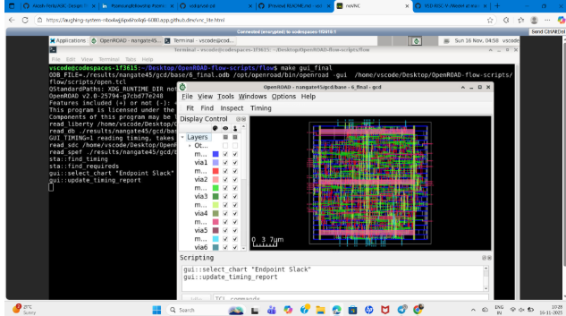

# Week 8 Task – Post-Layout STA & Timing Graphs Across PVT Corners for RoutedVSDBabySoC

## ObjectiveTo perform Post-Layout Static Timing Analysis (STA) using the SPEF generated afterrouting in Week 7, analyze timing across all PVT corners, and compare post-route resultswith post-synthesis timing data from Week 3

Post-layout STA with SPEF and multiple PVT corners is about recomputing all path delays using real extracted RC parasitics and corner-specific .lib data, then comparing these “realistic” slacks to the ideal post-synthesis numbers to judge tape-out readiness. This explains why Week 8 timing often differs significantly from Week 3 timing even though the logical netlist is the same.

Static timing analysis basics
Static Timing Analysis (STA) checks whether every timing path in a design meets setup and hold constraints without running dynamic simulations. It uses:

Gate/interconnect delay models from Liberty (.lib) libraries.

Structural connectivity from the gate-level netlist.

Constraints from SDC (clocks, I/O delays, false/multicycle paths).

For each path, STA computes:

Arrival time (AT): time when data reaches an endpoint.

Required time (RT): latest (for setup) or earliest (for hold) time allowed by clock constraints.

Slack=RT−AT for setup, and 
Slack=ATmin−RTmin
  for hold (sign convention can vary, but violation always means negative slack).

PVT corners and timing behavior
PVT corners model fabrication and operating variations using different .lib files:

Process: TT (typical), SS (slow-slow), FF (fast-fast), sometimes more (SF, FS, etc.).

Voltage: low Vdd (slower, worse setup) vs high Vdd (faster, more hold risk).

Temperature: high T (slower devices, often worst for setup) vs low T (faster devices, worst for hold).

For setup checks, worst case is usually slow process, low Vdd, high T (e.g., SS, 1.6 V, 125°C).
For hold checks, worst case is usually fast process, high Vdd, low T (e.g., FF, 1.95 V, -40°C).

In OpenSTA, corners are defined and linked to different .lib files, then STA is run for each corner, giving WNS/TNS and WHS/THS per corner.

Role of SPEF and post-layout STA
Pre-layout (Week 3) STA uses ideal or estimated interconnect (often only cell internal delays and simple wire models), so delay is dominated by gate delays. After routing, an extractor generates a SPEF file that contains:

Lumped and distributed RC values per net (capacitances to ground, coupling caps, resistive segments).

Connectivity of parasitic network (nodes and segments for each routed net).

When SPEF is annotated in OpenSTA, the interconnect delay is recomputed using these RCs, making:

Long, high-fanout or congested nets much slower (larger Elmore delay).

Coupling capacitances alter effective capacitance and can cause additional delay or noise.

Thus, post-layout STA replaces simplistic wire models with SPEF-based RC networks, which often increases path delay and can reduce setup slack compared to post-synthesis.

WNS, TNS, WHS, THS definitions
Across each corner and check type, tools summarize timing as:

WNS (Worst Negative Slack): most negative setup slack among all endpoints; if ≥ 0, setup is met everywhere at that corner.

TNS (Total Negative Slack): sum of all negative setup slacks; indicates how many paths and how badly they are failing.

WHS (Worst Hold Slack): most negative hold slack (earliest-arrival violation); if ≥ 0, hold is clean.

THS (Total Hold Slack): sum of all negative hold slacks; measures aggregate hold problem size.


Why post-route timing differs from pre-route
The logical connectivity is identical, but physical details change delays:

Added wire resistance and capacitance: routed nets are longer and narrower than the ideal, increasing RC delay and load on drivers.

Coupling capacitance: dense routing introduces C between adjacent nets; tools often convert this into effective load or extra delay, worsening critical paths.

Clock-tree synthesis: CTS changes clock arrival times (skew, insertion delay), which shifts both setup and hold windows on all sequential elements.

As a result:

Setup: WNS/TNS often degrade (become more negative) at slow corners after routing because data paths slow down more than clock paths, especially on long interconnects.

Hold: WHS/THS can improve or worsen; sharper and faster clock/data edges at fast corners, combined with skew changes, frequently create new hold violations on very short paths.

Design optimizations in PD (buffer insertion, upsizing, re-routing) try to fix this by balancing:

Reducing long path delays (fix setup) via upsizing or buffering, which may hurt hold on short segments.

Adding delay elements or using smaller cells on very short paths (fix hold), which must not compromise setup at other corners.

Timing graphs and multi-corner analysis
A timing graph models the circuit as:

Nodes: pins of cells and ports.

Edges: timing arcs (cell delays) and interconnect segments (wire delays with RC).

For each clock domain and corner, STA propagates early and late arrival times through the graph, then reports paths and slacks. When you “plot timing graphs” in Week 8 (like Day 26 examples), you are essentially visualizing:

The critical or near-critical paths (edges with largest contributions to delay).

How the same logical path’s delay and slack change from TT to SS to FF because both cell delays (.lib) and net delays (SPEF) are corner-dependent.

Physical effects and timing closure
SPEF-based post-layout STA exposes real physical effects that control whether the design is tape-out ready:

Interconnect RC: dominates delay at advanced nodes and for long global nets, making physical placement and routing crucial.

Crosstalk / coupling: can increase effective delay or create noise-induced violations; sign-off flows often use advanced models, but even simple coupling reduction in OpenSTA shows its impact.

Voltage/temperature dependence: at different corners, cell drive strengths and wire resistivities change, so parasitic-limited paths can move between safe and violating depending on corner.

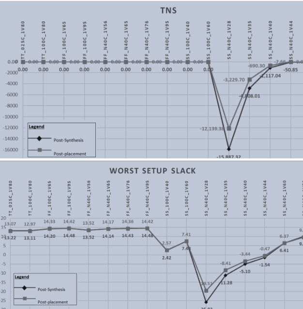
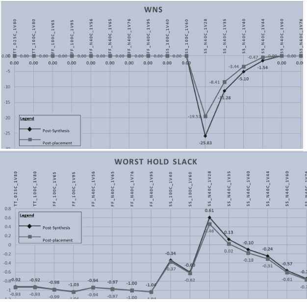
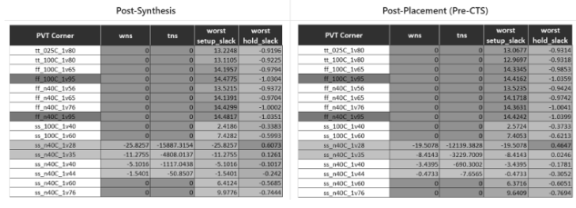
